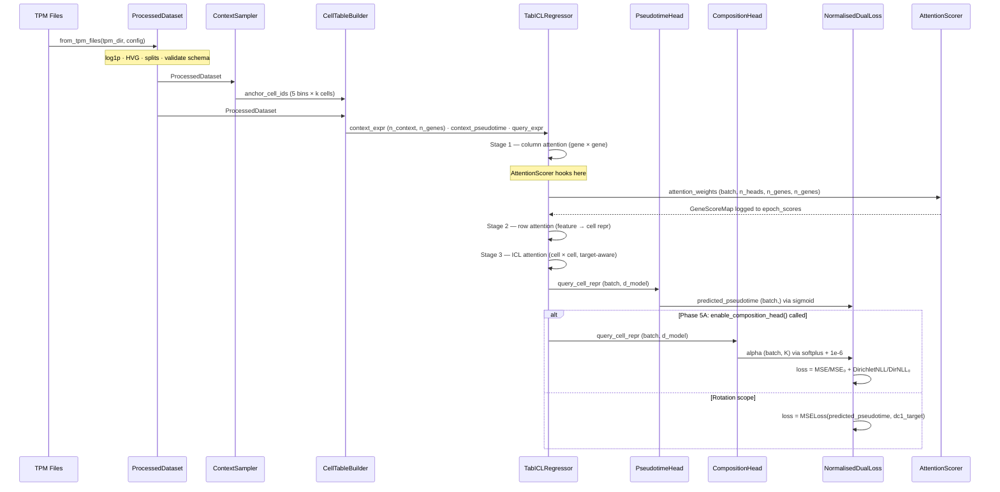
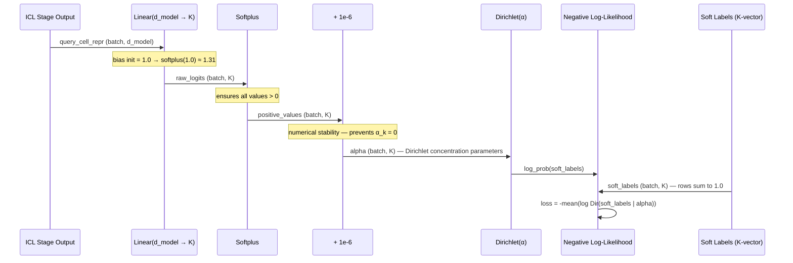
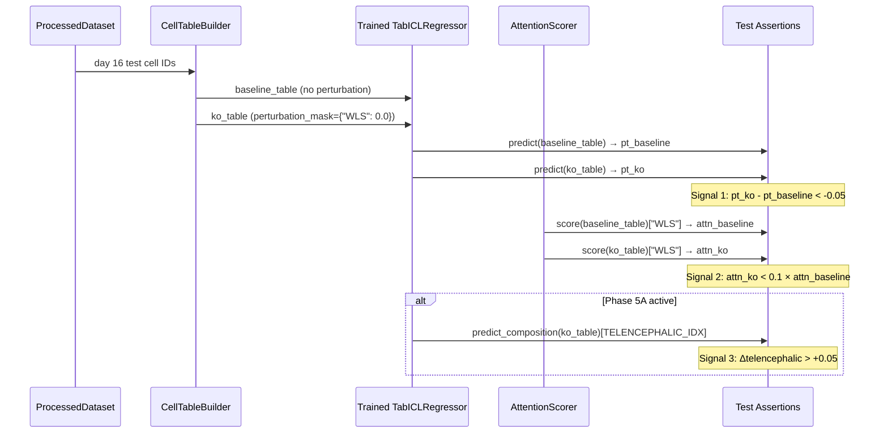

# Technical Design Document
## TabGRN-ICL: Tabular Foundation Model for Dynamic GRN Inference

**Version:** 1.0.0  
**Status:** Rotation Scope Active · Full Project Stubs Present  
**Project:** Joint rotation — Queen Mary University London / University College London  
**Supervisors:** Dr. Julien Gautrot · Dr. Yanlan Mao · Dr. Isabel Palacios  
**Author:** Christian Langridge  
**Last Updated:** March 2026

---

## Table of Contents

1. [System Overview](#1-system-overview)
2. [Directory Structure](#2-directory-structure)
3. [Component Specifications](#3-component-specifications)
4. [Workflow & Data Flow](#4-workflow--data-flow)
5. [Implementation Details](#5-implementation-details)
6. [Integration Guide](#6-integration-guide)
7. [Configuration Reference](#7-configuration-reference)
8. [Test Architecture](#8-test-architecture)
9. [Deployment & Compute](#9-deployment--compute)
10. [Decision Log](#10-decision-log)

---

## 1. System Overview

### 1.1 Architectural Goals

TabGRN-ICL is a tabular in-context learning model for dynamic gene regulatory network (GRN) inference from single-cell RNA sequencing data. It is trained on the Jain et al. 2025 (Nature) brain organoid time-course dataset and targets two simultaneous prediction objectives:

| Objective | Output | Head | Status |
|---|---|---|---|
| Pseudotime regression | Scalar ∈ (0, 1) mapping to DC1 | `PseudotimeHead` | **Rotation scope — active** |
| Cell state composition | K-vector of Dirichlet parameters | `CompositionHead` | Full project — Phase 5A |

The model uses the **TabICLv2** pre-trained backbone, adapted for continuous regression targets via a dual-head output architecture. Column-wise attention (stage 1) is the primary source of GRN signal — it learns gene-gene regulatory dependencies as a byproduct of trajectory prediction, without requiring a prior adjacency matrix.

### 1.2 Core Design Principles

- **Explicit over implicit.** Every hyperparameter lives in `ExperimentConfig`. No magic numbers in implementation code.
- **Schema contracts at construction.** `ProcessedDataset` validates its own schema at build time. Failures surface immediately, not mid-training.
- **Phase gates.** Full-project components exist in the codebase as tested skeletons. They are not wired into training until their phase gate is explicitly opened (`model.enable_composition_head()`).
- **Tests as first-class artifacts.** RED phase tests are written before implementation. The WLS perturbation integration test is the only test with a wet-lab validated expected answer.
- **Hardware-tier portability.** Three named hardware tiers (`debug`, `standard`, `full`) ensure reproducibility across laptop, V100, and A100 without code changes.

### 1.3 Scientific Context

The model operates on the Matrigel-only condition of the Jain et al. 2025 time-course, which tracks brain organoid development across five collection days: 5, 7, 11, 16, 21. Pseudotime is sourced directly from the paper's Diffusion Component 1 (DC1), which is validated against chronological collection day in Figure 2b. Day 11 cells are withheld as a test set — they represent the neuroectoderm-to-neuroepithelial transition, the hardest interpolation point on the trajectory.

The WLS gene serves as the primary biological validation target. Jain et al. Figure 5h–k demonstrates that WLS knockout prevents non-telencephalic fate induction. The model's in-silico WLS knockout must reproduce this directional prediction.

---

## 2. Directory Structure

```
SMT-Pipeline/
├── pyproject.toml                      # Package registration — pip install -e .
├── smt_pipeline.yml                    # Conda environment
├── slurm_jobs.sh                       # Myriad HPC job scripts (all tiers)
├── LICENSE
├── README.md
│
├── experiments/                        # Auto-created at runtime
│   └── {run_id}/
│       ├── config.json                 # Serialised ExperimentConfig (every run)
│       ├── metrics.json                # MAE · attention_entropy · top20_bio_overlap
│       ├── shap_background.npy         # Locked SHAP background (created once, frozen)
│       └── checkpoints/
│           └── best_model.pt
│
├── data/
│   ├── EDA_tpm/
│   │   └── EDA_processed/
│   │       └── processed_tpm.csv       # Primary training data (Matrigel time-course)
│   └── model_data/
│       └── fleck_2022/                 # External validation — Fleck et al. 2022
│
├── path/
│   └── spatialmt/                      # Installable package root
│       │
│       ├── __init__.py
│       │
│       ├── config/
│       │   ├── __init__.py             # Re-exports: Dirs, Paths, PROJECT_ROOT
│       │   ├── paths.py                # Filesystem path resolution (env var + sentinel walk)
│       │   └── experiment.py           # ExperimentConfig + all sub-configs
│       │
│       ├── data/
│       │   ├── __init__.py
│       │   ├── dataset.py              # ProcessedDataset — schema-validated container
│       │   ├── manifest.py             # FeatureManifest — versioned gene set
│       │   └── loaders/
│       │       ├── __init__.py
│       │       ├── jain_loader.py      # Loads Jain et al. 2025 TPM files
│       │       └── fleck_loader.py     # Loads Fleck et al. 2022 (Phase 7)
│       │
│       ├── context/
│       │   ├── __init__.py
│       │   ├── sampler.py              # ContextSampler — 5-bin pseudotime stratification
│       │   └── builder.py              # CellTableBuilder — unified matrix construction
│       │
│       ├── model/
│       │   ├── __init__.py
│       │   ├── tabicl.py               # TabICLRegressor — main model wrapper
│       │   ├── heads/
│       │   │   ├── __init__.py
│       │   │   ├── pseudotime.py       # PseudotimeHead — sigmoid scalar output
│       │   │   └── composition.py      # CompositionHead — Dirichlet K-vector [Phase 5A]
│       │   └── baselines/
│       │       ├── __init__.py
│       │       ├── xgboost_baseline.py # XGBoost on HVG expression
│       │       ├── tabpfn_baseline.py  # TabPFN v2 performance ceiling [Phase 6]
│       │       ├── no_icl_baseline.py  # Single-cell, no context [Phase 6]
│       │       └── scratch_baseline.py # TabICLv2 architecture, no pretrain [Phase 6]
│       │
│       ├── training/
│       │   ├── __init__.py
│       │   ├── trainer.py              # Training loop — normalised loss, warmup, callbacks
│       │   ├── callbacks.py            # AttentionScorer callback, checkpoint saver
│       │   ├── scheduler.py            # Warmup + cosine LR scheduler
│       │   └── loss.py                 # MSELoss, DirichletNLL, NormalisedDualLoss
│       │
│       ├── explainability/
│       │   ├── __init__.py
│       │   ├── protocols.py            # GeneScorer protocol + GeneScoreMap type alias
│       │   ├── scorers.py              # AttentionScorer (online) + SHAPScorer (offline)
│       │   ├── report.py               # ExplainabilityReport + disagreement taxonomy
│       │   └── perturbation.py         # PerturbationEngine — in-silico knockouts
│       │
│       └── evaluation/
│           ├── __init__.py
│           ├── metrics.py              # mae_day11, attention_entropy, top20_bio_overlap
│           ├── benchmark.py            # Five-model benchmark suite
│           └── external.py             # Fleck et al. 2022 zero-shot evaluation [Phase 7]
│
├── src/
│   └── experiments/
│       ├── run_tabicl_finetune.py      # Rotation primary — launches rotation_finetune preset
│       ├── run_xgboost_baseline.py     # Rotation baseline
│       ├── run_tabicl_scratch.py       # Ablation — no pretrain [Phase 6]
│       ├── run_tabicl_no_icl.py        # Ablation — no ICL [Phase 6]
│       └── run_full_dual_head.py       # Full dual-head run [Phase 5A]
│
└── tests/
    ├── conftest.py                     # Fixtures: debug_config, synthetic_dataset,
    │                                   # toy_model, synthetic_attention_weights,
    │                                   # correlated_expression,
    │                                   # synthetic_dataset_with_labels [Phase 5A]
    ├── unit/
    │   ├── test_dataset.py             # Schema contract tests (12 assertions)
    │   ├── test_experiment_config.py   # Serialisation, hash, preset tests
    │   ├── test_context_sampler.py     # Bin assignment, sparse bin warning
    │   ├── test_cell_table_builder.py  # Shape, perturbation mask, missing gene warning
    │   ├── test_attention_scorer.py    # Layer 1: synthetic weights, top gene, sum=1
    │   └── test_shap_scorer.py         # Locked background, correlated-feature sign stability
    ├── smoke/
    │   └── test_toy_forward_pass.py    # Layer 2: toy model, shapes, no NaN, (0,1) range
    ├── integration/
    │   ├── test_hold_out_split.py      # Zero intersection, day 11 only in test set
    │   └── test_wls_perturbation.py    # Two-signal WLS test (skips without checkpoint)
    └── biological_sanity/
        └── test_sox2_attention.py      # Layer 3: SOX2 in top-20 (manual, post-training)
```

---

## 3. Component Specifications

### 3.1 `ExperimentConfig`
**File:** `path/spatialmt/config/experiment.py`

**Purpose:** Single source of truth for all hyperparameters. Serialised to `experiments/{run_id}/config.json` at training startup. Every run is fully reproducible from its config file alone.

**Sub-configs:**

| Sub-config | Key fields | Notes |
|---|---|---|
| `DataConfig` | `max_genes`, `test_timepoint=11`, `hardware_tier`, `n_cell_states=5`, `label_softening_temperature=1.0` | `log1p_transform` is validated as `True` at construction; raises if `False` |
| `ContextConfig` | `n_bins=5`, `cells_per_bin=5`, `max_context_cells=50`, `allow_replacement=True` | Validates `n_bins × cells_per_bin ≤ max_context_cells` |
| `ModelConfig` | `lr_col=1e-5`, `lr_row=1e-4`, `lr_icl=5e-5`, `lr_emb=1e-3`, `lr_head=1e-3`, `warmup_col_steps=500`, `warmup_icl_steps=100`, `output_head_init_bias=0.5`, `output_head_init_std=0.01` | `bio_plausibility_passed` populated post-training |
| `ExplainabilityConfig` | `shap_background_size=100`, `shap_background_seed=42`, `bio_plausibility_required=["SOX2"]` | SOX2 absence in top-20 triggers fallback strategy |
| `PerturbationConfig` | `perturbation_mask={"WLS": 0.0}`, `pseudotime_delta_threshold=-0.05`, `attention_drop_fraction=0.1`, `composition_shift_threshold=0.05` | Signal 3 (composition) active only after `enable_composition_head()` |
| `BenchmarkConfig` | `baselines=["tabicl_finetune","xgboost"]` (rotation) | Full suite adds scratch, no_icl, tabpfn_v2 in Phase 6 |

**Named presets:**

```python
ExperimentConfig.debug_preset()           # 128 genes, CPU, 2 cells/bin
ExperimentConfig.rotation_finetune()      # 512 genes, V100, pseudotime only
ExperimentConfig.rotation_xgboost()       # XGBoost baseline, same HVG set
ExperimentConfig.full_finetune()          # 1024 genes, A100, dual-head [Phase 5A]
ExperimentConfig.scratch_preset()         # No pretrained weights [Phase 6]
ExperimentConfig.no_icl_preset()          # Single cell input [Phase 6]
```

**Dependencies:** `spatialmt.config.paths.Paths`, `dataclasses`, `json`, `hashlib`

---

### 3.2 `ProcessedDataset`
**File:** `path/spatialmt/data/dataset.py`

**Purpose:** Immutable, schema-validated container for one experiment's training data. Every downstream component receives this object; raw files are never accessed after construction.

**Fields:**

| Field | Shape | Type | Notes |
|---|---|---|---|
| `expression` | `(n_cells, n_genes)` | `np.float32` | log1p(TPM), validated max < 20.0 |
| `gene_names` | `(n_genes,)` | `list[str]` | HVG names in column order |
| `pseudotime` | `(n_cells,)` | `np.float32` | DC1 normalised to [0, 1] |
| `collection_day` | `(n_cells,)` | `np.int32` | ∈ {5, 7, 11, 16, 21} |
| `cell_ids` | `(n_cells,)` | `list[str]` | Unique identifiers |
| `train_cells` | `(n_cells,)` | `np.bool_` | Mutually exclusive with val/test |
| `val_cells` | `(n_cells,)` | `np.bool_` | 20% of non-test cells, stratified |
| `test_cells` | `(n_cells,)` | `np.bool_` | Day 11 only — enforced by `_validate()` |
| `soft_labels` | `(n_cells, K)` or `None` | `np.float32` | **Phase 5A** — `None` during rotation |
| `manifest_hash` | scalar | `str` | SHA-256 of gene_names + preprocessing_config |
| `preprocessing_config` | — | `dict` | Frozen record of all preprocessing decisions |

**Key methods:**

```python
ProcessedDataset.from_tpm_files(tpm_dir, config, gpu_memory_bytes)  # Primary constructor
ProcessedDataset._validate(instance)          # Schema assertion — called inside constructor
ProcessedDataset._check_memory_feasibility()  # Raises ConfigurationError before OOM
ProcessedDataset._build_splits()              # Day 11 test + stratified val
ProcessedDataset._compute_soft_labels()       # Distance-to-centroid softmax [Phase 5A]
ProcessedDataset._compute_manifest_hash()     # Deterministic, sorted key order
```

**Validation assertions (all checked at construction):**
- `train ∩ test = ∅`, `train ∩ val = ∅`, `val ∩ test = ∅`
- `set(collection_day[test_cells]) == {11}`
- `expression.max() < 20.0` — guards against raw TPM
- `pseudotime ∈ [0, 1]`
- No NaN or Inf in expression or pseudotime
- `soft_labels.sum(axis=1) ≈ 1.0` ± 1e-5 (when not None)

**Dependencies:** `numpy`, `pandas`, `spatialmt.config.experiment.DataConfig`

---

### 3.3 `ContextSampler`
**File:** `path/spatialmt/context/sampler.py`

**Purpose:** Samples anchor cells for the ICL context window using pseudotime-stratified bin sampling. Guarantees every context window contains representation from all five developmental stages.

**Bin layout:**

| Bin | Collection day | Pseudotime range |
|---|---|---|
| 0 | Day 5 | [0.0, 0.2) |
| 1 | Day 7 | [0.2, 0.4) |
| 2 | Day 11 | withheld — excluded from sampling |
| 3 | Day 16 | [0.6, 0.8) |
| 4 | Day 21 | [0.8, 1.0] |

**Sparse bin guard:** When a bin contains fewer cells than `cells_per_bin`, sampling proceeds with replacement and a `WARNING` is logged with the duplication count. This is auditable via `experiments/{run_id}/sampler_warnings.log`. Setting `allow_replacement=False` in `ContextConfig` raises instead.

**Inputs:** `ProcessedDataset`, `ContextConfig`, optional `bin_edges`  
**Output:** `(anchor_cell_ids: list[str], anchor_pseudotimes: np.ndarray)`

**Dependencies:** `numpy`, `spatialmt.data.dataset.ProcessedDataset`, `spatialmt.config.experiment.ContextConfig`

---

### 3.4 `CellTableBuilder`
**File:** `path/spatialmt/context/builder.py`

**Purpose:** Unified matrix construction for both context sampling and in-silico perturbation. Perturbation is architecturally identical to context construction with overrides applied — a single class handles both use cases, eliminating the most predictable DRY violation in the system.

**Primary method:**

```python
builder.build(
    cell_ids: list[str],
    perturbation_mask: dict[str, float] | None = None
) -> np.ndarray  # shape: (len(cell_ids), n_genes)
```

**Perturbation mask behaviour:**
- Each `{gene: value}` pair overrides the expression column for that gene
- Genes absent from `dataset.gene_names` (filtered by HVG selection) log a `WARNING` and are silently skipped
- The WLS knockout is `perturbation_mask={"WLS": 0.0}`

**Invariants enforced post-build:**
- Output shape == `(len(cell_ids), n_genes)`
- No NaN introduced by perturbation

**Dependencies:** `numpy`, `spatialmt.data.dataset.ProcessedDataset`, `spatialmt.config.experiment.ContextConfig`

---

### 3.5 `TabICLRegressor`
**File:** `path/spatialmt/model/tabicl.py`

**Purpose:** TabICLv2 backbone adapted for dual-head pseudotime regression and cell state composition. Manages differential learning rates, staged warmup, and the phase gate for enabling the composition head.

**Three-stage attention architecture:**

| Stage | Mechanism | LR | Warmup | Biological role |
|---|---|---|---|---|
| 1 — Column | Gene × gene attention | 1e-5 | 500 steps | GRN signal — `AttentionScorer` hooks here |
| 2 — Row | Feature → cell representation | 1e-4 | None | Aggregates gene context into cell vector |
| 3 — ICL | Cell × cell, target-aware | 5e-5 | 100 steps | Predicts query relative to anchor pseudotimes |

**Column embeddings:** Always re-initialised for `n_genes`. Pre-trained embeddings do not generalise to 512 gene tokens. Trained at `lr_emb=1e-3`.

**Phase gate:**
```python
model.enable_composition_head()
# Wires CompositionHead into forward().
# CALL ONLY AFTER:
#   1. Pseudotime-only model passes biological plausibility gate
#   2. soft_labels validated in ProcessedDataset
#   3. NormalisedDualLoss active in Trainer
```

**`configure_optimizers()` returns five parameter groups** (six after `enable_composition_head()`):
```python
[
    {"params": column_attention.parameters(),  "lr": 1e-5,  "name": "column_attention"},
    {"params": row_attention.parameters(),     "lr": 1e-4,  "name": "row_attention"},
    {"params": icl_attention.parameters(),     "lr": 5e-5,  "name": "icl_attention"},
    {"params": column_embeddings.parameters(), "lr": 1e-3,  "name": "column_embeddings"},
    {"params": pseudotime_head.parameters(),   "lr": 1e-3,  "name": "pseudotime_head"},
    # {"params": composition_head.parameters(), "lr": 1e-3, "name": "composition_head"},  # Phase 5A
]
```

**`on_training_step(step)` manages warmup:**
- At `step == warmup_col_steps`: unfreezes `column_attention_layers`, logs event
- At `step == warmup_icl_steps`: unfreezes `icl_attention_layers`, logs event

**Dependencies:** `torch`, `torch.nn`, `spatialmt.config.experiment.ModelConfig`

---

### 3.6 `PseudotimeHead`
**File:** `path/spatialmt/model/heads/pseudotime.py`

**Purpose:** Regression head producing a scalar pseudotime prediction in `(0, 1)` from the query cell representation.

**Architecture:** `Linear(d_model, 1)` → `sigmoid` → `squeeze(-1)`

**Input:** `(batch, d_model)` query cell representation from ICL stage  
**Output:** `(batch,)` predicted pseudotime ∈ `(0, 1)`

**Initialisation:**
```python
nn.init.normal_(self.linear.weight, mean=0.0, std=0.01)   # near-zero weights
nn.init.constant_(self.linear.bias, 0.5)                   # trajectory midpoint prior
```

**Loss:** `MSELoss(predicted_pseudotime, dc1_target)`

**Key property:** Sigmoid guarantees output ∈ `(0, 1)` — predictions can never exceed the DC1 range. Boundary cells at day 5 (DC1 ≈ 0) and day 21 (DC1 ≈ 1) cannot generate destabilising gradients from overshooting.

---

### 3.7 `CompositionHead`
**File:** `path/spatialmt/model/heads/composition.py`

**Purpose:** Dirichlet head producing K concentration parameters representing cell state affinity across K=5 developmental states. Models uncertainty over the composition simplex rather than producing a point estimate.

**Architecture:** `Linear(d_model, K)` → `softplus` → `+ 1e-6`

**Input:** `(batch, d_model)` query cell representation (same vector as `PseudotimeHead`)  
**Output:** `(batch, K)` Dirichlet concentration parameters `α_k`, all strictly positive

**K=5 cell state index mapping:**

| Index | State | Dominant timepoint |
|---|---|---|
| 0 | Neuroectodermal progenitor | Day 5 |
| 1 | Neural tube neuroepithelial | Day 7 |
| 2 | Prosencephalic progenitor | Day 11 |
| 3 | Telencephalic progenitor | Day 16 |
| 4 | Early neuron | Day 21 |

**Initialisation:**
```python
nn.init.normal_(self.linear.weight, mean=0.0, std=0.01)
nn.init.constant_(self.linear.bias, 1.0)   # softplus(1.0) ≈ 1.31 ≈ Dir(1,...,1) uniform prior
```

**Loss:** Negative Dirichlet log-likelihood against soft labels  
**Target:** `soft_labels ∈ (0, 1)^K` with rows summing to 1.0 — computed by distance-to-centroid softmax from `ProcessedDataset`

**Phase gate:** Instantiated at model construction but not called in `forward()` until `model.enable_composition_head()` is invoked.

---

### 3.8 `NormalisedDualLoss`
**File:** `path/spatialmt/training/loss.py`

**Purpose:** Balances MSE and Dirichlet NLL so neither head dominates during training. Without balancing, Dirichlet NLL is approximately 38× larger than MSE at K=5 initialisation, driving almost all gradient signal.

**Mechanism:**
```python
# Step 0: compute initial loss values and freeze them
mse_0    = MSE(predictions_step0,    targets_pseudotime)    # ≈ 0.083
dir_nll_0 = DirichletNLL(alpha_step0, targets_soft_labels)  # ≈ 3.18 for K=5

# Every subsequent step:
loss = (mse_loss / mse_0) + (dir_nll_loss / dir_nll_0)
```

**Properties:**
- Both terms equal 1.0 at step zero — equal gradient contribution from step one
- Scale-invariant to batch size and hardware tier
- `mse_0` and `dir_nll_0` are stored in `experiments/{run_id}/config.json` under `initial_loss_scales`

**Active only after:** `model.enable_composition_head()` — rotation scope uses plain `MSELoss`

---

### 3.9 `GeneScorer` Protocol
**File:** `path/spatialmt/explainability/protocols.py`

**Purpose:** Shared interface for all gene importance scoring methods. Adding a new method (e.g., Integrated Gradients) requires one new class; no changes to existing code.

```python
class GeneScorer(Protocol):
    @property
    def name(self) -> str: ...

    def score(
        self,
        model: object,
        dataset: ProcessedDataset,
        query_cells: np.ndarray,
    ) -> GeneScoreMap: ...          # GeneScoreMap = dict[str, float]

    def top_k(self, ..., k: int = 20) -> list[str]: ...
```

**Implementors:** `AttentionScorer`, `SHAPScorer`

---

### 3.10 `AttentionScorer`
**File:** `path/spatialmt/explainability/scorers.py`

**Purpose:** Extracts column-attention weights from stage 1 of the TabICLv2 backbone. Produces a `GeneScoreMap` where each gene's score is its mean outgoing attention weight across heads and query cells — representing how much other genes depend on it.

**Execution context:** Online — runs as a training callback after each epoch.

**Stage specificity guard:**
```python
# AssertionError raised if hook is registered on row or ICL attention layers
assert layer_type == "column", (
    f"AttentionScorer must target column attention only. "
    f"Got layer_type='{layer_type}'. GRN interpretation requires stage 1."
)
```

**Score computation:**
```python
# weights shape: (batch, n_heads, n_genes, n_genes)
# Mean over batch and heads → (n_genes, n_genes)
# Mean outgoing weight per gene → (n_genes,)
# Assert sum ≈ 1.0 (softmax invariant)
```

**Per-epoch monitoring:** Logs Shannon entropy of scores. High entropy (model attends uniformly) signals that column attention has not learned a discriminative structure — the trigger for the biological plausibility gate.

---

### 3.11 `SHAPScorer`
**File:** `path/spatialmt/explainability/scorers.py`

**Purpose:** KernelSHAP-based gene importance scoring. Model-agnostic — works on any baseline (XGBoost, TabPFN v2) without modification, enabling direct comparison of SHAP rankings across the benchmark suite.

**Execution context:** Offline — runs post-training on the frozen model checkpoint.

**Locked background:**
- Pseudotime-stratified sample of `shap_background_size=100` cells
- Drawn with `shap_background_seed=42`
- Saved to `experiments/{run_id}/shap_background.npy` on first call, loaded on all subsequent calls
- Never regenerated — ensures reproducibility across SHAP runs

**Stability guarantees (tested):**
- Top-5 SHAP genes are identical across two seeded runs with the same background
- Correlated features (Pearson r ≈ 1.0) produce SHAP values with identical sign

---

### 3.12 `ExplainabilityReport`
**File:** `path/spatialmt/explainability/report.py`

**Purpose:** Reconciles `AttentionScorer` and `SHAPScorer` outputs into a structured disagreement taxonomy. The taxonomy classifies every gene into one of three classes per inference call.

**Disagreement taxonomy:**

| Class | Condition | Biological interpretation |
|---|---|---|
| `CONCORDANT` | Both high or both low | Clean signal — report with confidence |
| `ATTENTION_ONLY` | High attention, low SHAP | Spurious correlation — gene is attended to but does not drive prediction |
| `SHAP_ONLY` | Low attention, high SHAP | **GRN relay node** — gene drives prediction via indirect regulatory path invisible to column attention |

**`SHAP_ONLY` genes are the primary scientific output.** They are candidates for cross-referencing against known GRN databases (TRRUST, RegNetwork, ChEA3).

**Output type:** `ExplainabilityResult` dataclass with properties:
- `concordant_genes`, `attention_only_genes`, `shap_only_genes`
- `attention_entropy`, `spearman_correlation`
- `bio_plausibility_passed`, `missing_required_genes`
- `paper_validated_in_top_attention`

---

## 4. Workflow & Data Flow

### 4.1 Training Data Flow



### 4.2 Composition Head Data Flow (Phase 5A)



### 4.3 WLS Perturbation Test Flow



---

## 5. Implementation Details

### 5.1 Softplus Activation

`CompositionHead` uses `torch.nn.Softplus` rather than `torch.nn.ReLU` or `torch.exp` to produce strictly positive Dirichlet concentration parameters.

```python
self.softplus = nn.Softplus()   # log(1 + exp(x))

def forward(self, x: torch.Tensor) -> torch.Tensor:
    return self.softplus(self.linear(x)) + 1e-6
```

**Why Softplus over alternatives:**

| Activation | Issue |
|---|---|
| `ReLU` | Produces exact zero for negative inputs — Dirichlet undefined at α=0 |
| `exp` | Numerically unstable for large positive inputs — overflow risk |
| `sigmoid` | Bounded to (0,1) — Dirichlet concentration parameters should not be capped at 1 |
| `Softplus` | Smooth, strictly positive, unbounded above, numerically stable |

### 5.2 Epsilon for Numerical Stability

```python
alpha = self.softplus(self.linear(x)) + 1e-6
```

The `1e-6` additive epsilon prevents two failure modes:

1. **Floating-point underflow.** Softplus is theoretically > 0 for all inputs but can underflow to 0.0 in float32 for large negative linear outputs early in training (before the bias initialisation takes effect).
2. **Dirichlet undefined at boundary.** `torch.distributions.Dirichlet.log_prob()` computes `(α-1) * log(x)` — if `α = 0`, this is `-inf` regardless of the input, producing NaN gradients on the first backward pass.

The epsilon is small enough that it has no meaningful effect on the distribution shape for `α > 0.01`.

### 5.3 Bias Initialisation Logic

**PseudotimeHead:**
```python
nn.init.constant_(self.linear.bias, 0.5)
# sigmoid(0.5) = 0.622 — slightly above midpoint
# In practice this means: at step 0, every cell is predicted slightly above DC1 midpoint
# The model learns trajectory by deviating from this prior
# This keeps initial MSE ≈ 0.083 (variance of Uniform[0,1])
# rather than ≈ 25-100 with random init (unstable initial gradients)
```

**CompositionHead:**
```python
nn.init.constant_(self.linear.bias, 1.0)
# softplus(1.0) ≈ 1.313
# All 5 concentration parameters initialised near 1.31
# This approximates Dir(1.31, 1.31, 1.31, 1.31, 1.31) — near-uniform
# The model learns state affinity by deviating from uniform assignment
# Initial Dirichlet NLL ≈ log Γ(K×1.31) - K×log Γ(1.31) ≈ 3.2 for K=5
```

**Weight initialisation (both heads):**
```python
nn.init.normal_(self.linear.weight, mean=0.0, std=0.01)
# Near-zero weights ensure predictions cluster near the bias at step 0
# Prevents large initial gradients from high-expression outlier cells
# Without this, a gene expressed at TPM 10000 (log1p ≈ 9.2) would
# push predictions far outside [0,1] before the sigmoid can compensate
```

### 5.4 Soft Label Generation (Phase 5A)

```python
def _compute_soft_labels(expression_pca, cluster_ids, config):
    # 1. Compute cluster centroids in PCA space (top 50 PCs)
    centroids = {k: expression_pca[cluster_ids == k].mean(axis=0) for k in range(K)}

    # 2. For each cell: distances to all centroids
    distances = np.array([
        [np.linalg.norm(cell - centroids[k]) for k in range(K)]
        for cell in expression_pca
    ])

    # 3. Temperature-scaled softmax of negative distances
    scaled = -distances / config.label_softening_temperature
    exp_scaled = np.exp(scaled - scaled.max(axis=1, keepdims=True))  # numerical stability
    soft_labels = exp_scaled / exp_scaled.sum(axis=1, keepdims=True)

    # Biological sanity check:
    # Day 5 cells should have highest mean affinity for state 0 (neuroectodermal)
    assert soft_labels[collection_day == 5, 0].mean() > 0.5

    return soft_labels.astype(np.float32)
```

**Temperature effects:**

| Temperature | Effect |
|---|---|
| `τ → 0` | Hard labels — each cell assigned entirely to nearest centroid |
| `τ = 0.5` | Sharp soft labels — cells near boundaries remain ambiguous |
| `τ = 1.0` | Default — moderate softness, appropriate for organoid data |
| `τ = 5.0` | Very soft — most cells near-uniform across states |

### 5.5 Memory Pre-Check

```python
@staticmethod
def _check_memory_feasibility(n_genes, d_model, batch_size, gpu_memory_bytes):
    # Column attention matrix: batch × n_heads × n_genes × n_genes × float32
    attn_bytes = batch_size * (n_genes ** 2) * d_model * 4
    budget = gpu_memory_bytes * 0.60   # 60% safety margin

    if attn_bytes > budget:
        raise ConfigurationError(
            f"Column attention on {n_genes} genes requires "
            f"~{attn_bytes / 1e9:.1f} GB "
            f"(budget: {budget / 1e9:.1f} GB).\n"
            f"Reduce max_genes or use hardware_tier='full' on A100 (Myriad)."
        )
```

**Tier safe limits:**

| Tier | max_genes | GPU | Safe batch size |
|---|---|---|---|
| `debug` | 128 | Any CPU | 2 |
| `standard` | 512 | V100 16GB | 16 |
| `full` | 1024 | A100 40GB | 32 |

---

## 6. Integration Guide

### 6.1 Rotation Scope Training Loop

```python
from spatialmt.config.experiment import ExperimentConfig
from spatialmt.data.dataset import ProcessedDataset
from spatialmt.context.sampler import ContextSampler
from spatialmt.context.builder import CellTableBuilder
from spatialmt.model.tabicl import TabICLRegressor
from spatialmt.explainability.scorers import AttentionScorer
from spatialmt.training.trainer import Trainer

# 1. Load and save config (creates experiments/{run_id}/config.json)
cfg = ExperimentConfig.rotation_finetune(run_id="rotation_001")
cfg.save()

# 2. Build validated dataset
dataset = ProcessedDataset.from_tpm_files(
    tpm_dir=cfg.data.tpm_dir,
    config=cfg.data,
)

# 3. Instantiate model with pre-trained weights
model = TabICLRegressor.load_pretrained(
    config=cfg.model,
    n_genes=dataset.n_genes,
    checkpoint_path="weights/tabicl_v2_pretrained.pt",
)

# 4. Instantiate context components
sampler = ContextSampler(dataset, cfg.context)
builder = CellTableBuilder(dataset, cfg.context)

# 5. Instantiate AttentionScorer callback
attention_scorer = AttentionScorer(cfg.explainability)

# 6. Train (pseudotime head only — rotation scope)
trainer = Trainer(
    model=model,
    dataset=dataset,
    sampler=sampler,
    builder=builder,
    config=cfg,
    callbacks=[attention_scorer],
)
trainer.fit()

# 7. Metrics written automatically to experiments/rotation_001/metrics.json
```

### 6.2 Enabling the Composition Head (Phase 5A)

```python
# After pseudotime-only model passes biological plausibility gate:
# 1. Verify bio_plausibility_passed = True
assert cfg.model.bio_plausibility_passed is True, \
    "Do not enable composition head before biological plausibility gate passes."

# 2. Verify soft_labels are present in the dataset
assert dataset.has_soft_labels, \
    "ProcessedDataset must be rebuilt with soft labels before enabling composition head."

# 3. Enable the head
model.enable_composition_head()

# 4. Switch to dual loss
from spatialmt.training.loss import NormalisedDualLoss
trainer.loss_fn = NormalisedDualLoss()   # Computes initial scales on first batch

# 5. Retrain from the pseudotime checkpoint (warm start)
trainer.fit(resume_from="experiments/rotation_001/checkpoints/best_model.pt")
```

### 6.3 Running the WLS Perturbation Test

```python
import os
os.environ["TABGRN_CHECKPOINT"] = "experiments/rotation_001/checkpoints/best_model.pt"

# Run the integration test suite
# pytest tests/integration/test_wls_perturbation.py -v
#
# Signal 1: predict(ko) - predict(baseline) < -0.05
# Signal 2: attention(ko)["WLS"] < 0.1 × attention(baseline)["WLS"]
# Signal 3: composition shift toward telencephalic [Phase 5A only]
```

### 6.4 Callback Registration

The `AttentionScorer` must be registered before training starts. It hooks into the column attention layer via a PyTorch forward hook registered at training start and removed at training end.

```python
# Inside Trainer.fit():
for epoch in range(n_epochs):
    for batch in dataloader:
        ...
        loss.backward()
        optimizer.step()
        model.on_training_step(global_step)   # Handles warmup unfreezing

    # End of epoch — run attention scorer on day 11 test cells
    for callback in self.callbacks:
        callback.on_epoch_end(model, dataset, epoch)
        # AttentionScorer logs entropy, appends to epoch_scores
```

---

## 7. Configuration Reference

### 7.1 Hardware Tier Defaults

```python
HARDWARE_TIERS = {
    "debug":    {"max_genes": 128,  "batch_size": 2,  "max_context_cells": 10},
    "standard": {"max_genes": 512,  "batch_size": 16, "max_context_cells": 50},
    "full":     {"max_genes": 1024, "batch_size": 32, "max_context_cells": 100},
}
```

### 7.2 Biological Plausibility Gate

The plausibility gate must pass before the model is used for scientific interpretation.

**Required gene (hard gate):** `SOX2` must appear in top-20 column attention genes on day 11 test cells.  
**Monitored genes:** `POU5F1`, `WLS`, `YAP1`, `SIX3`, `LHX2`

**Fallback decision tree:**
```
Bio plausibility FAILED
        │
        ├─► Check attention_entropy at epoch 20
        │       │
        │       ├─► entropy > 8.5 (near-uniform over 512 genes)
        │       │       → Pre-training bias is harmful
        │       │       → Switch ModelConfig.finetune_strategy = "scratch"
        │       │       → Retrain from scratch
        │       │
        │       └─► entropy < 8.5 (model is focused, wrong genes)
        │               → LR schedule issue
        │               → Reduce lr_col to 5e-6, increase warmup_col_steps to 1000
        │               → Retrain from fine-tuned checkpoint
        │
        └─► If both attempts fail:
                → max_genes is likely too low
                → Switch to hardware_tier="full" on A100
                → Resubmit with max_genes=1024
```

---

## 8. Test Architecture

### 8.1 Test Layers and Scope

| Layer | Location | Requires | Runs in CI |
|---|---|---|---|
| Unit | `tests/unit/` | Synthetic fixtures only | Yes |
| Smoke | `tests/smoke/` | Toy model (untrained) | Yes |
| Integration | `tests/integration/` | Trained model checkpoint (skips without) | Partially |
| Biological sanity | `tests/biological_sanity/` | Trained model + real data | Manual only |

### 8.2 Key Test Fixtures

```python
# conftest.py — session-scoped, built once per test run

synthetic_dataset           # 100 cells, 10 genes, day 11 test, soft_labels=None
toy_model                   # TabICLRegressor(n_layers=2, d_model=32, n_genes=10)
synthetic_attention_weights # (n_heads=2, n_genes=10) — SOX2 boosted to highest weight
correlated_expression       # GENE_02 and GENE_03 perfectly correlated (SHAP stability)

# Phase 5A fixture
synthetic_dataset_with_labels   # synthetic_dataset + Dirichlet soft_labels (K=5)
                                # @pytest.mark.full_project — skipped during rotation
```

### 8.3 Critical Tests

```python
# Highest priority — run before any implementation code

# ProcessedDataset schema contracts
assert np.sum(dataset.train_cells & dataset.test_cells) == 0
assert set(dataset.collection_day[dataset.test_cells]) == {11}
assert dataset.expression.max() < 20.0

# WLS perturbation (requires checkpoint — skips otherwise)
assert predict(ko_table) - predict(baseline_table) < -0.05           # Signal 1
assert attention(ko_table)["WLS"] < 0.1 * attention(baseline)["WLS"]  # Signal 2

# AttentionScorer softmax invariant
assert abs(sum(scores.values()) - 1.0) < 1e-5

# Memory pre-check
with pytest.raises(ConfigurationError):
    ProcessedDataset._check_memory_feasibility(
        n_genes=20000, d_model=128, batch_size=32,
        gpu_memory_bytes=16 * 1024**3
    )
```

---

## 9. Deployment & Compute

### 9.1 UCL Myriad Job Submission

```bash
# Step 1 — always run debug tier first (validates pipeline on CPU, no queue)
qsub slurm_jobs.sh   # see DEBUG_SCRIPT section

# Step 2 — rotation primary (submit by Week 7, May 6th)
qsub slurm_jobs.sh   # see ROTATION_FINETUNE_SCRIPT section
# Resources: V100 16GB, 24h, 32GB RAM

# Step 3 — XGBoost baseline (can run locally, no GPU needed)
python -m spatialmt.model.baselines.xgboost_baseline --preset rotation_xgboost

# Phase 5A — full dual-head (A100, submit July onwards)
qsub slurm_jobs.sh   # see FULL_FINETUNE_SCRIPT section
# Resources: A100 40GB, 48h, 64GB RAM
```

### 9.2 Environment Setup

```bash
# Clone and install
git clone https://github.com/ChristianLangridge/SMT-Pipeline.git
cd SMT-Pipeline
conda env create -f smt_pipeline.yml
conda activate smt_pipeline
pip install -e .                    # Registers spatialmt package

# Verify installation
python -c "from spatialmt.config import Paths; print(Paths.processed_tpm)"

# Run unit tests (no GPU, no real data required)
pytest tests/unit/ tests/smoke/ -v
```

### 9.3 Critical Milestones

| Date | Milestone |
|---|---|
| Week 2 end (Apr 1) | AnnData inspected — DC1, cluster labels, cell counts confirmed |
| Week 5 end (Apr 22) | `ProcessedDataset.from_tpm_files()` green, all unit tests passing |
| Week 7 end (May 6) | **First Myriad GPU job submitted — critical gate** |
| Week 10 (May 27) | Biological plausibility gate — SOX2 in top-20 |
| Week 11 (Jun 3) | WLS perturbation Signals 1 + 2 passing |
| Week 15 (Jul 3) | Rotation report + talk submitted |
| Phase 5A start (Jul+) | Composition head enabled, dual-head training begins |

---

## 10. Decision Log

| Decision | Rationale | Alternatives considered |
|---|---|---|
| TabICLv2 as backbone | Native regression pre-training; clean two-stage attention; ICL with target-aware embeddings | TabICLv1 (classification-only pre-training), scGPT (gene-token, incompatible explainability) |
| DC1 as pseudotime target | Already computed in paper; validated against chronological collection day in Fig. 2b; no external tool needed | scVelo velocity pseudotime, Palantir branch probabilities |
| Day 11 withheld as test set | Hardest interpolation point — neuroectoderm-to-neuroepithelial transition | Random 80/20 split (correlated cells from same batch would leak), leave-one-out (too slow for rotation) |
| Dirichlet head over softmax | Models uncertainty over composition; flat Dirichlet = transitional cell; `Σα_k` is a meaningful confidence readout | Softmax (point estimate, no uncertainty), GMM posterior (requires separate clustering) |
| Distance-to-centroid softening | Preserves paper's biologically validated cluster identities; deterministic; temperature is explicit hyperparameter | Fuzzy c-means (clusters may not align with paper's annotations), GMM (arbitrary cluster order) |
| Normalised dual loss | Scale-invariant to batch size and hardware tier; both heads contribute equally from step 1 | Fixed λ annealing (requires tuning), manual λ (not portable across hardware) |
| XGBoost as primary baseline | Widely understood by biologists; no architectural assumptions; fastest to run; strong precedent for scRNA-seq | Linear regression (too weak), TabPFN v2 (useful ceiling but slower to set up) |
| Matrigel-only training (v1) | Linear trajectory; no branching topology; WLS perturbation has a clear directional ground truth | Both conditions combined (branching DC1 collapses into ambiguous [0,1] range) |
| `AttentionScorer` stage specificity guard | Silent extraction from wrong stage produces biologically uninterpretable weights with no error signal | Warning only (insufficient — wrong stage would invalidate all GRN claims) |
| 500-step column attention warmup | Column embeddings are re-initialised for gene count; pre-trained patterns must not be perturbed before embeddings stabilise | No warmup (column attention perturbed immediately by random embeddings), full freeze (column attention never fine-tunes) |

---

*This document reflects all architectural decisions made in the design review session. Implementation code lives in the `tabgrn_v2_skeleton` directory. The rotation scope (pseudotime-only, XGBoost baseline, WLS Signal 1) targets July 3rd. Full dual-head project continues from that date.*