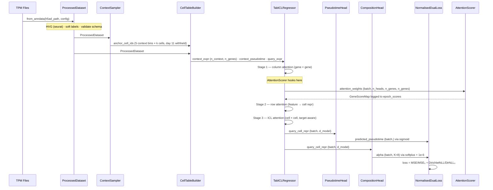
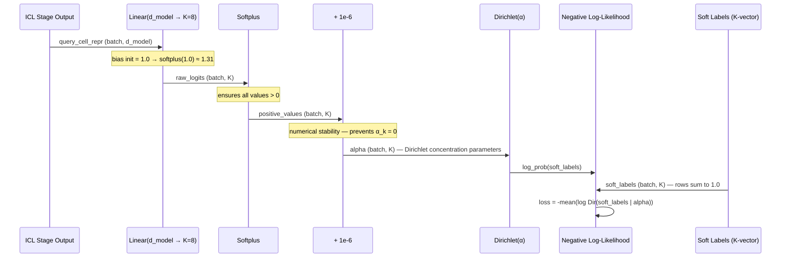

# Technical Design Document
## TabGRN-ICL: Tabular Foundation Model for Dynamic GRN Inference

**Version:** 1.7.0  
**Status:** Rotation Scope Active · Dual-Head · Full Trajectory  
**Project:** Joint rotation — Queen Mary University London / University College London  
**Supervisors:** Dr. Julien Gautrot · Dr. Yanlan Mao · Dr. Isabel Palacios  
**Author:** Christian Langridge  
**Last Updated:** May 2026

**Changelog v1.7.0**
- §2: `training/` marked ✓ Implemented; `experiments/` checkpoint dir updated to include `loss_curve.png`
- §3 new §3.9–3.11: `Trainer`, `MuonAdamW`, and `CheckpointCallback` documented
- §3.2: `_check_memory_feasibility` removed from key methods (dead code — never called)
- §3.5: `load_backbone()` key-exclusion behaviour documented — `col_embedder.*` always excluded (pretrained weights are position-based, incompatible with gene-name-indexed input)
- §5.5: Memory pre-check section removed (dead code deleted along with 3 tests)
- §7.1: `batch_size` removed from `HARDWARE_TIERS` — training is batch=1 per step; field was never consumed by `Trainer.fit()`
- §8.2a: Test counts updated — 300 unit tests GREEN; trainer (65) and callbacks (19) suites added; 3 dead memory-feasibility tests deleted
- §8.3: Memory pre-check critical test removed
- §9.3: Week 7 end milestone marked complete
- §10: New decisions T1–T5 (training layer) added

**Changelog v1.6.0**
- §2: `context/` marked ✓ Implemented; `collate.py` added to directory listing
- §3.3: `ContextSampler` marked ✓ Implemented; actual method signatures documented
- §3.4: `CellTableBuilder` API corrected — actual return type is `(CellTable, TrainingTargets)`, not `np.ndarray`; `perturbation_mask` parameter removed (not implemented); `CellTable` and `TrainingTargets` dataclasses documented
- §3.4b: New section — `ICLBatch` and `icl_collate` (collate.py) documented
- §3.1: `AblationTarget` dataclass documented; `ModelConfig.lr_emb` added to field table
- §8.2a: Test counts updated — 77 new tests (context_sampler: 22, cell_table_builder: 27, icl_collate: 28); total 219 unit tests GREEN
- §9.3: Week 7 end milestone marked complete

**Changelog v1.5.0**
- Renamed `tabicl.py` → `tabgrn.py` across the codebase and TDD; `test_tabicl_model.py` → `test_tabgrn_model.py`
- §3.6: `PseudotimeHead` file path corrected from planned `model/heads/pseudotime.py` to actual `model/tabgrn.py` (all sub-modules live in one file)

**Changelog v1.4.0**
- §2: Directory structure updated — `data_preparation2/` merged into `data_preparation/`; `model/` marked implemented (not planned); `heads/` subdirectory removed (heads live directly in `tabgrn.py`); `training/loss.py` updated to reflect `DualHeadLoss`
- §3.5: `TabICLRegressor` fully implemented — architecture corrected; 4 parameter groups (col, row, icl, head) replacing the previously-planned 6; `AnchorLabelEmbedder` (formerly `LabelInjector`) documented; `ICLAttention` removed, replaced by pretrained `tabicl.model.encoders.Encoder` (`tf_icl`)
- §3.7: `CompositionHead` corrected — uses `softmax` + KL divergence loss, not `softplus` + Dirichlet NLL (interim design, Dirichlet NLL planned for a later phase)
- §3.8: `NormalisedDualLoss` replaced by `DualHeadLoss` — Kendall uncertainty weighting with learnable log σ² parameters
- §5.1: Softplus section updated to reflect current softmax implementation
- §8: Test counts updated — 219 unit tests GREEN; `test_tabgrn_model.py` and `test_dual_head_loss.py` marked implemented
- §9.3: Week 7 milestone status updated

**Changelog v1.3.0**
- §2: Directory structure updated to reflect actual layout (`data_preparation/`, `data_preparation2/`); test folder structure updated post-merge
- §3.2: File path corrected to `data_preparation2/dataset.py`; `from_anndata` marked fully implemented (not a stub); pseudotime field updated to reflect diffusion pseudotime computed
- §6.1: Import paths corrected to `spatialmt.data_preparation2.dataset`
- §8.2a: Test file locations updated to `tests/integration/`; `test_dataset.py` integration suite added
- §9.3: Week 6 milestone marked complete

**Changelog v1.2.0**
- §1: Trajectory extended to days 5–30; both heads active in rotation; pseudotime recomputed; perturbation strategy revised
- §3.1: `DataConfig.n_cell_states=8`; `ContextConfig.n_bins=6`; `BenchmarkConfig` updated for regression baseline ladder
- §3.2: `ProcessedDataset` evolving from `prep.py`; no train/val/test split in data prep; fields updated
- §3.3: `ContextSampler` 6-bin layout with day 30
- §3.5: Phase gate removed — both heads from training start; 6 parameter groups always active
- §3.7: `CompositionHead` K=8 from `class3` annotations
- §3.8: `NormalisedDualLoss` active from training start
- §4: Data flow updated for dual-head rotation; perturbation flow updated for composition-primary signal
- §8: Data preparation test architecture added
- §9.3: Milestones updated for dual-head rotation scope
- §10: 16 new decisions from baseline/scope/data-prep review sessions

---

## Table of Contents

1. [System Overview](#1-system-overview)
2. [Directory Structure](#2-directory-structure)
3. [Component Specifications](#3-component-specifications)
4. [Workflow & Data Flow](#4-workflow--data-flow)
5. [Implementation Details](#5-implementation-details)
6. [Integration Guide](#6-integration-guide)
7. [Configuration Reference](#7-configuration-reference)
8. [Test Architecture](#8-test-architecture)
9. [Deployment & Compute](#9-deployment--compute)
10. [Decision Log](#10-decision-log)

---

## 1. System Overview

### 1.1 Architectural Goals

TabGRN-ICL is a tabular in-context learning model for dynamic gene regulatory network (GRN) inference from single-cell RNA sequencing data. It is trained on the Jain et al. 2025 (Nature) brain organoid time-course dataset and targets two simultaneous prediction objectives:

| Objective | Output | Head | Status |
|---|---|---|---|
| Pseudotime regression | Scalar ∈ (0, 1) — developmental progression | `PseudotimeHead` | **Rotation scope — active** |
| Cell state composition | K-vector of Dirichlet parameters — lineage identity | `CompositionHead` | **Rotation scope — active** |

The model uses the **TabICLv2** pre-trained backbone, adapted for continuous regression targets via a dual-head output architecture. The two heads capture orthogonal information: **pseudotime measures progression** (distance from root along the main developmental axis), while **composition measures identity** (which lineage(s) a cell belongs to). On a branching trajectory, two cells equidistant from root on different branches get similar pseudotime but distinct composition vectors. Column-wise attention (stage 1) is the primary source of GRN signal — it learns gene-gene regulatory dependencies as a byproduct of both prediction tasks, without requiring a prior adjacency matrix.

### 1.2 Core Design Principles

- **Explicit over implicit.** Every hyperparameter lives in `ExperimentConfig`. No magic numbers in implementation code.
- **Schema contracts at construction.** `ProcessedDataset` validates its own schema at build time. Failures surface immediately, not mid-training. Currently evolving from `prep.py` extraction functions into a full dataclass wrapper.
- **Dual-head from start.** Both heads are active during rotation-scope training. No phase gate — the composition head is not deferred.
- **Tests as first-class artifacts.** RED phase tests are written before implementation. The WLS perturbation integration test is the only test with a wet-lab validated expected answer.
- **Hardware-tier portability.** Three named hardware tiers (`debug`, `standard`, `full`) ensure reproducibility across laptop, V100, and A100 without code changes.

### 1.3 Scientific Context

The model operates on the Matrigel-only condition of the Jain et al. 2025 time-course, which tracks brain organoid development across six collection days: 5, 7, 11, 16, 21, 30 (~41,000 cells). The trajectory branches after day 11 into telencephalic vs. non-telencephalic lineages.

**Pseudotime** is recomputed via diffusion map on the full trajectory (days 5–30), replacing the published DC1 which only covers days 5–11 neuroectodermal cells. Expression matrices from different batches (sampling data) were integrated with the Cluster Similarity Spectrum (CSS)  technique outlined by the Treutlein Lab. Diffusion pseudotime was then computed over the full trajectory excluding the unknown proliferating cell population (post-hoc labelled). Day 11 cell target labels (pseudotime and hard classification labels) are withheld from model training/context — they represent the neuroectoderm-to-neuroepithelial transition, the hardest interpolation point.

**Perturbation validation** uses WLS and GLI3 as primary biological targets. WLS-KO (day 55) and GLI3-KO (day 45) datasets from Fleck et al. are **external GRN validation tools, not model inputs** — both are far outside the training distribution (days 5–30). Paired WT controls at the same timepoints enable WT vs. KO gene expression comparison to validate the attention-derived GRN. In-silico perturbation (zeroing target gene expression in training-distribution cells) tests whether the model's learned GRN captures regulatory relationships consistent with the real knockout biology. WLS knockout should primarily produce a **composition shift** away from non-telencephalic states.

---

## 2. Directory Structure

```
TabGRN/
├── pyproject.toml                      # Package registration — pip install -e .
├── myriad_tabgrn.sh                    # SLURM job script — rotation_finetune on Myriad GPU
├── LICENSE
├── README.md
│
├── experiments/                        # Auto-created at runtime
│   └── {run_id}/
│       ├── config.json                 # Serialised ExperimentConfig (every run)
│       ├── metrics.json                # MAE · attention_entropy · top20_bio_overlap [planned]
│       ├── shap_background.npy         # Locked SHAP background (created once, frozen) [planned]
│       └── checkpoints/
│           ├── step_NNNNNN.pt          # Checkpoint every EVAL_EVERY steps (model + optimizer + loss_fn)
│           └── loss_curve.png          # 3-panel loss curve: total / pseudotime / composition
│
├── data/
│   ├── EDA/                            # Lancaster time-series bulk RNA-seq
│   │   ├── Original_TPM_data.csv
│   │   └── processed/
│   │       └── processed_tpm.csv
│   ├── TabICLv2_checkpoint/
│   │   └── tabicl-regressor-v2-20260212.ckpt   # Pretrained backbone
│   ├── training_data/
│   │   └── AnnData/
│   │       └── neurectoderm_complete.h5ad       # Jain et al. 2025 (Matrigel condition)
│   ├── WLS_ko_validation/
│   │   └── AnnData/
│   │       └── WLS_ko.h5ad                      # External validation — Jain et al. 2025
│   └── GLI3_ko_validation/
│       └── AnnData/
│           └── GLI3_ko.h5ad                     # External validation — He et al. 2022
│
├── path/
│   └── spatialmt/                      # Installable package root (pip install -e .)
│       │
│       ├── __init__.py
│       │
│       ├── config/                     # ✓ Implemented
│       │   ├── __init__.py             # Re-exports: Dirs, Paths, PROJECT_ROOT
│       │   ├── paths.py                # Filesystem path resolution (env var + sentinel walk)
│       │   └── experiment.py           # ExperimentConfig + all sub-configs + HARDWARE_TIERS
│       │
│       ├── data_preparation/           # ✓ Implemented
│       │   ├── __init__.py
│       │   ├── prep.py                 # HVG selection, expression extraction, PreparedData
│       │   ├── diffusion_trajectory.py # CSS integration, diffusion pseudotime, merge_and_save
│       │   └── dataset.py              # ProcessedDataset — from_anndata, soft labels, validation
│       │
│       ├── context/                    # ✓ Implemented
│       │   ├── __init__.py
│       │   ├── sampler.py              # ContextSampler — day-stratified anchor sampling
│       │   ├── builder.py              # CellTableBuilder + CellTable + TrainingTargets
│       │   └── collate.py              # ICLBatch + icl_collate — DataLoader collate fn
│       │
│       ├── model/                      # ✓ Implemented
│       │   ├── __init__.py
│       │   ├── tabgrn.py               # TabICLRegressor + AnchorLabelEmbedder + SharedTrunk
│       │   │                           # + PseudotimeHead + CompositionHead + AttentionScorer
│       │   ├── loss.py                 # DualHeadLoss — Kendall uncertainty weighting
│       │   └── baselines/              # [planned]
│       │       ├── __init__.py
│       │       ├── protocol.py         # BaselineModel Protocol
│       │       ├── mean_baseline.py    # Mean predictor — variance floor
│       │       ├── ridge_baseline.py   # Ridge on PCs — linearity test
│       │       ├── xgboost_baseline.py # XGBoost regressor — primary competitor
│       │       ├── tabpfn_baseline.py  # TabPFN v2 performance ceiling [Phase 6]
│       │       ├── no_icl_baseline.py  # Single-cell, no context [Phase 6]
│       │       └── scratch_baseline.py # TabICLv2 architecture, no pretrain [Phase 6]
│       │
│       ├── training/                   # ✓ Implemented
│       │   ├── __init__.py
│       │   ├── trainer.py              # Trainer + MuonAdamW — step-budget loop, warmup, loss_history
│       │   ├── callbacks.py            # CheckpointCallback — saves model/optimizer/loss_fn/step
│       │   └── muon.py                 # Muon optimizer (Newton-Schulz spectral orthogonalisation)
│       │
│       ├── explainability/             # [planned]
│       │   ├── __init__.py
│       │   ├── protocols.py            # GeneScorer protocol + GeneScoreMap type alias
│       │   ├── scorers.py              # AttentionScorer (online) + SHAPScorer (offline)
│       │   ├── report.py               # ExplainabilityReport + disagreement taxonomy
│       │   └── perturbation.py         # PerturbationEngine — in-silico knockouts
│       │
│       └── evaluation/                 # [planned]
│           ├── __init__.py
│           ├── metrics.py              # mae_day11, attention_entropy, top20_bio_overlap
│           ├── benchmark.py            # Five-model benchmark suite
│           └── external.py             # Fleck et al. 2022 zero-shot evaluation [Phase 7]
│
├── src/
│   ├── EDA_plotting/
│   │   ├── PCA.py
│   │   ├── temporal_heatmap.py
│   │   └── temporal_lineplot.py
│   ├── data_prep/
│   │   ├── data_prep.py
│   │   └── PCA_exploration.py
│   ├── figures/
│   │   ├── batch_qc.py
│   │   ├── cell_identity_proba.py
│   │   └── pseudotime_regression.py
│   └── train/
│       ├── tabgrn_debug_run.py         # Local debug run — rotation_finetune on MPS/CPU, 500 steps
│       ├── tabgrn_myriad_run.py        # Full Myriad run — 10,000 steps, checkpointing, loss curve
│       ├── XGB_classifier_run.py       # Baseline — XGBClassifier (cell identity)
│       ├── XGB_regressor_run.py        # Baseline — XGBRegressor (pseudotime)
│       ├── linear_regressor_run.py     # Baseline — linear regression
│       └── nearest_centroid_run.py     # Baseline — NearestCentroid classifier
│
└── tests/
    ├── conftest.py                     # Fixtures: debug_config, synthetic_dataset,
    │                                   # synthetic_dataset_with_labels
    ├── unit/
    │   ├── test_experiment_config.py   # ExperimentConfig — serialisation, hash, presets (32 tests) ✓
    │   ├── test_dataset.py             # ProcessedDataset schema contract (26 tests) ✓
    │   ├── test_tabgrn_model.py        # TabICLRegressor + sub-modules (53 tests) ✓
    │   ├── test_dual_head_loss.py      # DualHeadLoss — Kendall weighting, KL divergence (26 tests) ✓
    │   ├── test_context_sampler.py     # ContextSampler — bin assignment, sparse bin warning (22 tests) ✓
    │   ├── test_cell_table_builder.py  # CellTableBuilder + CellTable + TrainingTargets (27 tests) ✓
    │   ├── test_icl_collate.py         # ICLBatch + icl_collate — shapes, ragged guard (28 tests) ✓
    │   ├── test_trainer.py             # Trainer + MuonAdamW — fit(), warmup, loss_history (65 tests) ✓
    │   ├── test_callbacks.py           # CheckpointCallback — file creation, contents, restore (19 tests) ✓
    │   └── test_shap_scorer.py         # Locked background, correlated-feature sign stability [planned]
    ├── smoke/                          # [planned]
    │   └── test_toy_forward_pass.py    # Layer 2: toy model, shapes, no NaN, (0,1) range
    ├── integration/
    │   ├── test_dataset.py             # from_anndata integration tests (18 tests) ✓
    │   ├── test_prep.py                # prep.py HVG, pseudotime, prepare_dataset tests ✓
    │   ├── test_hold_out_split.py      # Zero intersection, day 11 only in test set [planned]
    │   └── test_wls_perturbation.py    # Two-signal WLS test (skips without checkpoint) [planned]
    └── biological_sanity/              # [planned]
        └── test_sox2_attention.py      # Layer 3: SOX2 in top-20 (manual, post-training)
```

---

## 3. Component Specifications

### 3.1 `ExperimentConfig`
**File:** `path/spatialmt/config/experiment.py`

**Purpose:** Single source of truth for all hyperparameters. Serialised to `experiments/{run_id}/config.json` at training startup. Every run is fully reproducible from its config file alone.

**Sub-configs:**

| Sub-config | Key fields | Notes |
|---|---|---|
| `DataConfig` | `max_genes`, `test_timepoint=11`, `hardware_tier`, `n_cell_states=8`, `label_softening_temperature=1.0` | `log1p_transform` is validated as `True` at construction; raises if `False` |
| `ContextConfig` | `n_bins=6`, `cells_per_bin=5`, `max_context_cells=50`, `allow_replacement=True` | Validates `n_bins × cells_per_bin ≤ max_context_cells`; bin 2 (day 11) withheld |
| `ModelConfig` | `lr_col=1e-5`, `lr_row=1e-4`, `lr_icl=5e-5`, `lr_emb=1e-3`, `lr_head=1e-3`, `warmup_col_steps=500`, `warmup_icl_steps=100`, `output_head_init_bias=0.5`, `output_head_init_std=0.01` | `lr_emb` is for column embeddings (always re-initialised); `bio_plausibility_passed` populated post-training |
| `ExplainabilityConfig` | `shap_background_size=100`, `shap_background_seed=42`, `bio_plausibility_required=("SOX2",)`, `ih_n_steps=50`, `ih_baseline_strategy="day5_mean"`, `ih_top_k_edges=500` | SOX2 absence in top-20 triggers fallback strategy; IH fields configure Integrated Hessians |
| `AblationTarget` | `gene`, `zero_in_query=True`, `zero_in_context_states=None`, `zero_in_context_pseudotime_below=None`, `zero_in_context_pseudotime_above=None` | Composable per-gene ablation spec; supports query-only, population-wide, state-specific, and temporal-window variants |
| `PerturbationConfig` | `ablations=[AblationTarget(gene="WLS")]`, `pseudotime_delta_threshold=-0.05`, `attention_drop_fraction=0.1`, `composition_shift_threshold=0.05` | Default: single cell-autonomous WLS ablation; composition shift is primary signal |
| `BenchmarkConfig` | `baselines=["mean","ridge_pca","xgboost_regressor","tabicl_finetune"]` (rotation) | Dual-axis justification: prediction accuracy + GRN explainability |

**Named presets:**

```python
ExperimentConfig.debug_preset()           # 128 genes, CPU, 2 cells/bin
ExperimentConfig.rotation_finetune()      # 512 genes, V100, dual-head (pseudotime + composition)
ExperimentConfig.rotation_baselines()     # Baseline ladder: mean, ridge, xgboost regressor
ExperimentConfig.full_finetune()          # 1024 genes, A100, extended dual-head training
ExperimentConfig.scratch_preset()         # No pretrained weights [Phase 6]
ExperimentConfig.no_icl_preset()          # Single cell input [Phase 6]
```

**Dependencies:** `spatialmt.config.paths.Paths`, `dataclasses`, `json`, `hashlib`

---

### 3.2 `ProcessedDataset`
**File:** `path/spatialmt/data_preparation/dataset.py`

**Purpose:** Immutable, schema-validated container for one experiment's training data. Wraps the output of `data_preparation/prep.py` extraction functions with schema validation, soft label computation, and manifest hashing. Every downstream component receives this object; raw files are never accessed after construction.

**Fields:**

| Field | Shape | Type | Notes |
|---|---|---|---|
| `expression` | `(n_cells, n_genes)` | `np.float32` | log-normalised (CP10k+log1p from Zenodo), validated max < 20.0 |
| `gene_names` | `(n_genes,)` | `list[str]` | HVG names in column order (flavor=`seurat`) |
| `pseudotime` | `(n_cells,)` | `np.float32` | Diffusion pseudotime ∈ [0, 1] — recomputed via CSS + DPT on full trajectory (days 5–30); loaded from `adata.obs["rank-transformed-pseudotime"]` |
| `collection_day` | `(n_cells,)` | `np.int32` | ∈ {5, 7, 11, 16, 21, 30} |
| `cell_ids` | `(n_cells,)` | `list[str]` | Unique identifiers |
| `cell_type_labels` | `(n_cells,)` | `pd.Series` | `class3` annotations — 8 states |
| `orig_ident` | `(n_cells,)` | `pd.Series` | Timepoint strings (`HB4_D5`, etc.) |
| `soft_labels` | `(n_cells, K)` | `np.float32` | Distance-to-centroid softmax, K=8 |
| `manifest_hash` | scalar | `str` | SHA-256 of `sorted(gene_names)` |

**No train/val/test split in ProcessedDataset.** Split logic lives downstream:
- Baselines: `X_train = X[collection_day != 11]`, standard sklearn fit/predict
- TabICL: `ContextSampler` excludes day 11 from context bins; day 11 cells are query-only
- Both paradigms share the hold-out definition: **day 11 cells are never used for learning**

**Key methods:**

```python
ProcessedDataset.from_anndata(h5ad_path, config)  # Primary constructor — fully implemented
ProcessedDataset._validate(instance)               # Schema assertion — called inside constructor
ProcessedDataset._compute_soft_labels()            # Distance-to-centroid softmax, K=8
ProcessedDataset._compute_manifest_hash()          # SHA-256 of sorted gene names
ProcessedDataset.save(path) / .load(path)          # Atomic write with manifest (planned)
```

**Validation assertions (all checked at construction):**
- `expression.max() < 20.0` — guards against raw counts
- `pseudotime ∈ [0, 1]`
- No NaN or Inf in expression or pseudotime
- `soft_labels.sum(axis=1) ≈ 1.0` ± 1e-5
- `X.shape[0] == len(cell_ids) == len(cell_type_labels) == len(pseudotime)`
- `X.shape[1] == len(gene_names)`

**Auto-normalisation:** `from_anndata` auto-applies `normalize_total(target_sum=1e4)` + `log1p` if `adata.X.max() >= 20.0`. The `seurat` HVG flavor is always used; raw-count detection relies on the expression max threshold.

**Memory optimisation:** Densification deferred until after HVG selection. Peak: ~314 MB (41k × 2k × float32) instead of ~3.8 GB (41k × 24k × float32).

**Dependencies:** `numpy`, `pandas`, `scanpy`, `sklearn.decomposition.PCA`, `spatialmt.config.experiment.DataConfig`, `spatialmt.data_preparation.prep`

---

### 3.3 `ContextSampler`
**File:** `path/spatialmt/context/sampler.py` ✓ Implemented

**Purpose:** Samples anchor cells for the ICL context window using day-stratified bin sampling. Groups cells by `collection_day`, excludes the withheld test day (11), and samples `cells_per_bin` anchors from each active day-bin per query.

**Bin layout:**

| Bin | Collection day | Status |
|---|---|---|
| 0 | Day 5 | Context |
| 1 | Day 7 | Context |
| — | Day 11 | **Test — excluded from sampling** |
| 2 | Day 16 | Context |
| 3 | Day 21 | Context |
| 4 | Day 30 | Context |

Day-based grouping is used directly (5 active bins at runtime). `bin_edges` is accepted as an optional constructor argument and stored for future pseudotime-only binning mode.

**Sparse bin guard:** When a bin contains fewer eligible cells than `cells_per_bin`, sampling proceeds with replacement and a `UserWarning` is raised. Setting `allow_replacement=False` raises `ValueError` instead.

**Constructor:**
```python
ContextSampler(dataset: ProcessedDataset, config: ContextConfig, bin_edges=None)
```

**Primary method:**
```python
sampler.sample(query_cell_id: str, rng: Generator | int | None = None)
    -> (anchor_cell_ids: list[str], anchor_pseudotimes: np.ndarray[float32])
```
The query cell is excluded from its own context window. `rng` accepts a `np.random.Generator`, an `int` seed, or `None` (fresh unseeded generator).

**Dependencies:** `numpy`, `spatialmt.config.experiment.ContextConfig`, `spatialmt.data_preparation.dataset.ProcessedDataset`

---

### 3.4 `CellTableBuilder`, `CellTable`, `TrainingTargets`
**File:** `path/spatialmt/context/builder.py` ✓ Implemented

**Purpose:** Assembles model inputs and training targets for a single ICL training step. Enforces the model/loss boundary — query labels are never placed in `CellTable`; they are held separately in `TrainingTargets` and only touched by the loss function.

**Dataclasses:**

```python
@dataclass
class CellTable:
    context_expression:  np.ndarray  # (n_anchors, n_genes) float32 — model input
    context_pseudotime:  np.ndarray  # (n_anchors,)         float32 — model input
    context_soft_labels: np.ndarray  # (n_anchors, K)       float32 — model input
    query_expression:    np.ndarray  # (n_genes,)           float32 — model input

@dataclass
class TrainingTargets:
    query_pseudotime:  np.floating   # scalar float32 — loss only
    query_soft_labels: np.ndarray    # (K,) float32   — loss only
```

**Constructor:** `CellTableBuilder(dataset: ProcessedDataset)` — builds an O(1) `cell_id → row_index` lookup once; reused across all `build()` calls.

**Primary method:**
```python
builder.build(
    query_cell_id: str,
    anchor_ids: list[str],          # from ContextSampler.sample(); duplicates allowed
) -> tuple[CellTable, TrainingTargets]
```
Raises `KeyError` if any id is not in the dataset.

**Dependencies:** `numpy`, `dataclasses`, `spatialmt.data_preparation.dataset.ProcessedDataset`

---

### 3.4b `ICLBatch` and `icl_collate`
**File:** `path/spatialmt/context/collate.py` ✓ Implemented

**Purpose:** DataLoader collate function. Stacks a list of `(CellTable, TrainingTargets)` pairs into a single `ICLBatch` of torch.Tensors. All fields are `float32` on CPU; device transfer is handled by the training loop.

```python
@dataclass
class ICLBatch:
    context_expression:  torch.Tensor  # (B, n_anchors, n_genes)
    context_pseudotime:  torch.Tensor  # (B, n_anchors)
    context_soft_labels: torch.Tensor  # (B, n_anchors, K)
    query_expression:    torch.Tensor  # (B, n_genes)
    query_pseudotime:    torch.Tensor  # (B,)
    query_soft_labels:   torch.Tensor  # (B, K)

def icl_collate(batch: list[tuple[CellTable, TrainingTargets]]) -> ICLBatch
```

**Ragged guard:** Raises `ValueError` if any item has a different `n_anchors` than item 0 — ragged context windows are not supported.

**Dependencies:** `numpy`, `torch`, `spatialmt.context.builder.CellTable`, `spatialmt.context.builder.TrainingTargets`

---

### 3.5 `TabICLRegressor`
**File:** `path/spatialmt/model/tabgrn.py` ✓ Implemented

**Purpose:** TabICLv2 backbone adapted for dual-head pseudotime regression and cell state composition. Manages differential learning rates and staged warmup.

**Forward pass (five stages):**

| Stage | Module | Input → Output | LR | Warmup | Biological role |
|---|---|---|---|---|---|
| 1 — Column | `col_embedder` (`ColEmbedding`) | `(B, n_cells, n_genes)` → `(B, n_cells, seq_len, embed_dim)` | 1e-5 | 500 steps | GRN signal — `AttentionScorer` hooks here |
| 2 — Row | `row_interactor` (`RowInteraction`) | `(B, n_cells, seq_len, embed_dim)` → `(B, n_cells, d_model)` | 1e-4 | None | Aggregates gene context into cell vector |
| 3 — Label inject | `anchor_label_embedder` (`AnchorLabelEmbedder`) | `(B, n_cells, d_model)` + pseudotime/soft_labels → same | 1e-3 | None | Injects anchor targets into row representations (ICL protocol) |
| 4 — ICL | `tf_icl` (`tabicl.model.encoders.Encoder`, pretrained) | `(B, n_cells, d_model)` → same; query attends anchors only | 5e-5 | 100 steps | Predicts query relative to anchor context |
| 5 — Heads | `shared_trunk` → `pseudotime_head` + `composition_head` | `(B, d_model)` → `(B,)` + `(B, K)` | 1e-3 | None | Dual-head output |

`d_model = num_cls × embed_dim` (RowInteraction CLS token output dimension).

**`parameter_groups()` returns four groups:**
```python
[
    {"name": "col",  "params": list(self.col_embedder.parameters()),         "lr": cfg.lr_col},   # 1e-5
    {"name": "row",  "params": list(self.row_interactor.parameters()),        "lr": cfg.lr_row},   # 1e-4
    {"name": "icl",  "params": list(self.tf_icl.parameters()),                "lr": cfg.lr_icl},   # 5e-5
    {"name": "head", "params": (
        list(self.anchor_label_embedder.parameters())
        + list(self.shared_trunk.parameters())
        + list(self.pseudotime_head.parameters())
        + list(self.composition_head.parameters())
    ),                                                                         "lr": cfg.lr_head},  # 1e-3
]
```

**Critical implementation details:**
- `emb.clone()` passed to `row_interactor` — `RowInteraction._train_forward` performs an in-place write to CLS token slots; the clone prevents this from severing autograd to `col_embedder`
- `batch.context_pseudotime` always passed as `y_train` to `col_embedder`, even though `target_aware=False` — `ColEmbedding` reads `y_train.shape[1]` unconditionally for ISAB masking
- `tf_icl` loaded via `load_backbone(checkpoint_path)` with key remapping: `icl_predictor.tf_icl.*` → `tf_icl.*`; `col_embedder.*` keys are **always excluded** — pretrained column embeddings are position-indexed (feature order in the pretraining tabular task), not gene-name-indexed; they are reinitialised fresh for every TabGRN run
- Warmup/freeze scheduling (col: 500 steps, icl: 100 steps) implemented in `Trainer._apply_warmup_freeze()` — applied at the start of every step

**Dependencies:** `torch`, `torch.nn`, `tabicl.model.embedding.ColEmbedding`, `tabicl.model.interaction.RowInteraction`, `tabicl.model.encoders.Encoder`, `spatialmt.config.experiment.ModelConfig`

---

### 3.6 `PseudotimeHead`
**File:** `path/spatialmt/model/tabgrn.py` ✓ Implemented

**Purpose:** Regression head producing a scalar pseudotime prediction in `(0, 1)` from the query cell representation.

**Architecture:** `Linear(d_model, 1)` → `sigmoid` → `squeeze(-1)`

**Input:** `(batch, d_model)` query cell representation from ICL stage  
**Output:** `(batch,)` predicted pseudotime ∈ `(0, 1)`

**Initialisation:**
```python
nn.init.normal_(self.linear.weight, mean=0.0, std=0.01)   # near-zero weights
nn.init.constant_(self.linear.bias, 0.5)                   # trajectory midpoint prior
```

**Loss:** `MSELoss(predicted_pseudotime, pseudotime_target)` — target is recomputed diffusion pseudotime (scaffold: linearly scaled collection day)

**Key property:** Sigmoid guarantees output ∈ `(0, 1)` — predictions can never exceed the pseudotime range. Boundary cells at day 5 (pseudotime ≈ 0) and day 30 (pseudotime ≈ 1) cannot generate destabilising gradients from overshooting.

---

### 3.7 `CompositionHead`
**File:** `path/spatialmt/model/tabgrn.py` ✓ Implemented

**Purpose:** Softmax head producing a K-dimensional probability vector representing cell state affinity across K=8 developmental states (from `class3` annotations). Current interim design; Dirichlet NLL planned for a later phase.

**Architecture:** `Linear(d_model, K)` → `softmax(dim=-1)`

**Input:** `(batch, d_model)` query cell representation (same vector as `PseudotimeHead`)  
**Output:** `(batch, K)` soft probability vector, rows sum to 1.0 ∈ (0, 1)^K

**K=8 cell state index mapping:**

| Index | State | Cell count | Dominant timepoint |
|---|---|---|---|
| 0 | Neurectoderm | 10,001 | Day 5 |
| 1 | Late Neurectoderm | 7,962 | Day 7–11 |
| 2 | Unknown proliferating cells | 857 | Mixed |
| 3 | Prosencephalic progenitors | 1,506 | Day 11 |
| 4 | Late Prosencephalic progenitors | 4,275 | Day 11–16 |
| 5 | Telencephalic progenitors | 9,681 | Day 16–21 |
| 6 | Diencephalic progenitors | 4,899 | Day 16–21 |
| 7 | Tel/Die neurons | 1,878 | Day 21–30 |

**Initialisation (via `_init_linear` helper):**
```python
nn.init.normal_(self.linear.weight, std=0.01)
nn.init.constant_(self.linear.bias, 0.0)   # uniform-ish softmax prior at init
```

**Loss:** KL divergence KL(target ∥ pred) via `DualHeadLoss.composition_loss` — see §3.8  
**Target:** `soft_labels ∈ (0, 1)^K` with rows summing to 1.0 — computed by distance-to-centroid softmax from `ProcessedDataset`

**Planned upgrade:** Dirichlet NLL with `softplus` activation (Dirichlet concentration parameters α_k > 0) — deferred until rotation baseline is established (TDD v1.3.0 interim note)

---

### 3.8 `DualHeadLoss`
**File:** `path/spatialmt/model/loss.py` ✓ Implemented

**Purpose:** Uncertainty-weighted dual-head loss (Kendall, Gal & Cipolla, NeurIPS 2018). Learns the relative task weighting from data via learnable log σ² parameters, eliminating the need for manual λ tuning.

**Mechanism:**
```python
# Learnable log-variance parameters (nn.Parameter, 0-dim scalars)
s_pt   = log_sigma_sq_pt    # init = 0 → σ² = 1
s_comp = log_sigma_sq_comp  # init = 0 → σ² = 1

L_pt   = MSE(pt_pred, pt_target)
L_comp = KL(comp_target ∥ comp_pred)   # Σ_k π_k · (log π_k – log p_k)

total = exp(–s_pt)  · L_pt   + ½·s_pt
      + exp(–s_comp) · L_comp + ½·s_comp
```

**Properties:**
- At init (s=0): `total = L_pt + L_comp` — equal unit weighting
- ½·s penalty prevents σ → ∞ trivially zeroing both losses
- `log_sigma_sq_pt` and `log_sigma_sq_comp` must be included in the head parameter group alongside the model's head layers
- Returns `(total, L_pt, L_comp)` — total for `.backward()`, components for logging

**Active from training start** — both heads train simultaneously from step one.

---

### 3.9 `Trainer`
**File:** `path/spatialmt/training/trainer.py` ✓ Implemented

**Purpose:** Step-budget fine-tuning loop. Each step draws a fresh stochastic `(query_cell, context_cells)` ICL pair — there is no epoch boundary or convergence criterion. The loop runs for exactly `n_steps` gradient updates; callbacks fire every `eval_every` steps.

**Warmup / freeze schedule** (`_apply_warmup_freeze`, called at the start of every step):

| Component | Frozen while | Rationale |
|---|---|---|
| `col_embedder` | `global_step < warmup_col_steps` (500) | Random init would perturb the pretrained backbone before embeddings stabilise |
| `tf_icl` | `global_step < warmup_icl_steps` (100) | Allows dual heads to establish a gradient signal before the ICL transformer unfreezes |
| `row_interactor`, heads | Always trainable | No warmup needed |

**Query pool:** Day-11 cells are excluded from the query pool at construction (`_WITHHELD_DAY = 11`). `ContextSampler` separately excludes them from anchor bins — day-11 cells are never used for learning in any role.

**Optimizer:** `MuonAdamW` — see §3.10.

**`fit()` return value:**
```python
{
    "train_loss":   float,   # Kendall-weighted total — run average over all n_steps
    "pt_loss":      float,   # Raw MSE component — run average
    "comp_loss":    float,   # Raw KL divergence component — run average
    "loss_history": list[dict],  # One entry per eval_every interval:
                                 # {"step", "train_loss", "pt_loss", "comp_loss"}
                                 # Each value is the mean over that interval's steps.
                                 # Empty list if n_steps < eval_every.
}
```

`loss_history` enables post-training convergence diagnosis without requiring TensorBoard on Myriad. `tabgrn_myriad_run.py` reads it and saves a 3-panel PNG to the checkpoint directory.

**Note — effective batch size:** `icl_collate([(table, targets)])` is called with a single pair per step — batch size is always 1. `batch_size` has been removed from `HARDWARE_TIERS` (dead config). True batching (loop B query cells, pass list to `icl_collate`) is architecturally straightforward but deferred: the CPU-side `CellTableBuilder.build()` loop is the bottleneck, not GPU utilisation.

---

### 3.10 `MuonAdamW`
**File:** `path/spatialmt/training/trainer.py` ✓ Implemented

**Purpose:** Composite optimizer routing parameters to Muon or AdamW based on tensor dimensionality.

| Condition | Sub-optimizer | Rationale |
|---|---|---|
| `param.ndim >= 2` | Muon (Newton-Schulz spectral step) | Weight matrices — attention projections, FC weights |
| `param.ndim < 2` | AdamW | Biases, LayerNorm scales, Kendall log σ² scalars |

**Logical groups** (preserved on `MuonAdamW.param_groups` for LR inspection):
- `col` (lr 1e-5), `row` (lr 1e-4), `icl` (lr 5e-5), `head` (lr 1e-3), `loss` (lr 1e-3 — Kendall σ² parameters)

**Serialisation:** `state_dict()` / `load_state_dict()` delegate to the `_muon` and `_adamw` sub-optimizers, enabling full optimizer state persistence in `CheckpointCallback`.

---

### 3.11 `CheckpointCallback`
**File:** `path/spatialmt/training/callbacks.py` ✓ Implemented

**Purpose:** Saves a complete training snapshot every `every` steps. Fires inside `Trainer.fit()` via `on_epoch_end(model, dataset, step)`.

**Saved payload** (`step_NNNNNN.pt`):
```python
{
    "global_step":     int,
    "model_state":     model.state_dict(),
    "optimizer_state": trainer.optimizer.state_dict(),  # MuonAdamW — both sub-optimizers
    "loss_fn_state":   loss_fn.state_dict(),            # Kendall log_sigma_sq_pt + log_sigma_sq_comp
}
```

**Construction note:** `CheckpointCallback` requires a `Trainer` reference to access `trainer.optimizer` (assigned by `fit()` at runtime). The standard pattern uses late-wiring — construct with `trainer=None`, then assign after `Trainer` is built:
```python
checkpoint_cb = CheckpointCallback(trainer=None, loss_fn=loss_fn, out_dir=ckpt_dir, every=1000)
trainer = Trainer(..., callbacks=[checkpoint_cb])
checkpoint_cb.trainer = trainer
```

**Dependencies:** `torch`, `pathlib.Path`, `spatialmt.training.trainer.Trainer`, `spatialmt.model.loss.DualHeadLoss`

---

### 3.12 `GeneScorer` Protocol
**File:** `path/spatialmt/explainability/protocols.py`

**Purpose:** Shared interface for all gene importance scoring methods. Adding a new method (e.g., Integrated Gradients) requires one new class; no changes to existing code.

```python
class GeneScorer(Protocol):
    @property
    def name(self) -> str: ...

    def score(
        self,
        model: object,
        dataset: ProcessedDataset,
        query_cells: np.ndarray,
    ) -> GeneScoreMap: ...          # GeneScoreMap = dict[str, float]

    def top_k(self, ..., k: int = 20) -> list[str]: ...
```

**Implementors:** `AttentionScorer`, `SHAPScorer`

---

### 3.13 `AttentionScorer`
**File:** `path/spatialmt/explainability/scorers.py`

**Purpose:** Extracts column-attention weights from stage 1 of the TabICLv2 backbone. Produces a `GeneScoreMap` where each gene's score is its mean outgoing attention weight across heads and query cells — representing how much other genes depend on it.

**Execution context:** Online — runs as a training callback after each epoch.

**Stage specificity guard:**
```python
# AssertionError raised if hook is registered on row or ICL attention layers
assert layer_type == "column", (
    f"AttentionScorer must target column attention only. "
    f"Got layer_type='{layer_type}'. GRN interpretation requires stage 1."
)
```

**Score computation:**
```python
# weights shape: (batch, n_heads, n_genes, n_genes)
# Mean over batch and heads → (n_genes, n_genes)
# Mean outgoing weight per gene → (n_genes,)
# Assert sum ≈ 1.0 (softmax invariant)
```

**Per-epoch monitoring:** Logs Shannon entropy of scores. High entropy (model attends uniformly) signals that column attention has not learned a discriminative structure — the trigger for the biological plausibility gate.

---

### 3.14 `SHAPScorer`
**File:** `path/spatialmt/explainability/scorers.py`

**Purpose:** KernelSHAP-based gene importance scoring. Model-agnostic — works on any baseline (XGBoost, TabPFN v2) without modification, enabling direct comparison of SHAP rankings across the benchmark suite.

**Execution context:** Offline — runs post-training on the frozen model checkpoint.

**Locked background:**
- Pseudotime-stratified sample of `shap_background_size=100` cells
- Drawn with `shap_background_seed=42`
- Saved to `experiments/{run_id}/shap_background.npy` on first call, loaded on all subsequent calls
- Never regenerated — ensures reproducibility across SHAP runs

**Stability guarantees (tested):**
- Top-5 SHAP genes are identical across two seeded runs with the same background
- Correlated features (Pearson r ≈ 1.0) produce SHAP values with identical sign

---

### 3.15 `ExplainabilityReport`
**File:** `path/spatialmt/explainability/report.py`

**Purpose:** Reconciles `AttentionScorer` and `SHAPScorer` outputs into a structured disagreement taxonomy. The taxonomy classifies every gene into one of three classes per inference call.

**Disagreement taxonomy:**

| Class | Condition | Biological interpretation |
|---|---|---|
| `CONCORDANT` | Both high or both low | Clean signal — report with confidence |
| `ATTENTION_ONLY` | High attention, low SHAP | Spurious correlation — gene is attended to but does not drive prediction |
| `SHAP_ONLY` | Low attention, high SHAP | **GRN relay node** — gene drives prediction via indirect regulatory path invisible to column attention |

**`SHAP_ONLY` genes are the primary scientific output.** They are candidates for cross-referencing against known GRN databases (TRRUST, RegNetwork, ChEA3).

**Output type:** `ExplainabilityResult` dataclass with properties:
- `concordant_genes`, `attention_only_genes`, `shap_only_genes`
- `attention_entropy`, `spearman_correlation`
- `bio_plausibility_passed`, `missing_required_genes`
- `paper_validated_in_top_attention`

---

## 4. Workflow & Data Flow

### 4.1 Training Data Flow



### 4.2 Composition Head Data Flow



### 4.3 WLS Perturbation Test Flow

```mermaid
sequenceDiagram
    participant DS as ProcessedDataset
    participant CB as CellTableBuilder
    participant M as Trained TabICLRegressor
    participant AS as AttentionScorer
    participant T as Test Assertions

    DS->>CB: day 16 test cell IDs
    CB->>M: baseline_table (no perturbation)
    CB->>M: ko_table (perturbation_mask={"WLS": 0.0})

    M->>T: predict(baseline_table) → pt_baseline
    M->>T: predict(ko_table) → pt_ko
    Note over T: Signal 1: pt_ko - pt_baseline < -0.05

    AS->>T: score(baseline_table)["WLS"] → attn_baseline
    AS->>T: score(ko_table)["WLS"] → attn_ko
    Note over T: Signal 2: attn_ko < 0.1 × attn_baseline

    M->>T: predict_composition(ko_table) vs predict_composition(baseline_table)
    Note over T: Signal 3 (primary): composition shift away from non-telencephalic states
    end
```

---

## 5. Implementation Details

### 5.1 Composition Head Activation (Current: Softmax; Planned: Softplus + Dirichlet)

`CompositionHead` currently uses `torch.nn.functional.softmax` to produce a probability vector over K=8 cell states. This is an interim design — Dirichlet NLL with a `softplus` activation is planned for a later phase.

```python
def forward(self, x: torch.Tensor) -> torch.Tensor:
    return torch.softmax(self.linear(x), dim=-1)   # (B, K), rows sum to 1.0
```

**Loss:** KL divergence KL(target ∥ pred) — natural parameter-free measure between two probability distributions. KL = 0 iff pred == target exactly. No concentration hyperparameter required.

**Why KL divergence over Dirichlet NLL (current phase):**

| Loss | Requirement | Issue at this stage |
|---|---|---|
| KL divergence | Two probability distributions | Directly compares softmax outputs to soft labels — zero implementation complexity |
| Dirichlet NLL | Concentration parameters α_k > 0 | Requires softplus activation + epsilon; concentration scale interpretation less intuitive during rotation debugging |

**Planned upgrade:** `Linear(d_model, K)` → `softplus` → `+ 1e-6` → Dirichlet concentration parameters, with Dirichlet NLL loss. The `softplus + 1e-6` design note from v1.2.0 remains valid for the upgrade path.

### 5.2 Bias Initialisation Logic

**PseudotimeHead:**
```python
nn.init.constant_(self.linear.bias, 0.5)
# sigmoid(0.5) = 0.622 — slightly above midpoint
# In practice this means: at step 0, every cell is predicted slightly above DC1 midpoint
# The model learns trajectory by deviating from this prior
# This keeps initial MSE ≈ 0.083 (variance of Uniform[0,1])
# rather than ≈ 25-100 with random init (unstable initial gradients)
```

**CompositionHead:**
```python
nn.init.constant_(self.linear.bias, 0.0)
# softmax of zero-bias linear = uniform over K states at init (when weights ≈ 0)
# The model learns state affinity by deviating from this uniform prior
# Initial KL divergence against non-uniform soft labels drives early training signal
# (When Dirichlet NLL upgrade ships, bias will change to 1.0 → softplus(1.0) ≈ 1.31)
```

**Weight initialisation (both heads):**
```python
nn.init.normal_(self.linear.weight, mean=0.0, std=0.01)
# Near-zero weights ensure predictions cluster near the bias at step 0
# Prevents large initial gradients from high-expression outlier cells
# Without this, a gene expressed at TPM 10000 (log1p ≈ 9.2) would
# push predictions far outside [0,1] before the sigmoid can compensate
```

### 5.4 Soft Label Generation

K=8 states from `class3` annotations. Cluster centroids computed in PCA space, soft labels via temperature-scaled softmax of negative distances.

```python
def _compute_soft_labels(expression_pca, cluster_ids, config):
    # 1. Compute cluster centroids in PCA space (top 50 PCs)
    # K=8: Neurectoderm, Late Neurectoderm, Unknown proliferating,
    #       Prosencephalic, Late Prosencephalic, Telencephalic,
    #       Diencephalic, Tel/Die neurons
    centroids = {k: expression_pca[cluster_ids == k].mean(axis=0) for k in range(K)}

    # 2. For each cell: distances to all centroids
    distances = np.array([
        [np.linalg.norm(cell - centroids[k]) for k in range(K)]
        for cell in expression_pca
    ])

    # 3. Temperature-scaled softmax of negative distances
    scaled = -distances / config.label_softening_temperature
    exp_scaled = np.exp(scaled - scaled.max(axis=1, keepdims=True))  # numerical stability
    soft_labels = exp_scaled / exp_scaled.sum(axis=1, keepdims=True)

    # Biological sanity check:
    # Day 5 cells should have highest mean affinity for state 0 (Neurectoderm)
    assert soft_labels[collection_day == 5, 0].mean() > 0.5

    return soft_labels.astype(np.float32)
```

**Temperature effects:**

| Temperature | Effect |
|---|---|
| `τ → 0` | Hard labels — each cell assigned entirely to nearest centroid |
| `τ = 0.5` | Sharp soft labels — cells near boundaries remain ambiguous |
| `τ = 1.0` | Default — moderate softness, appropriate for organoid data |
| `τ = 5.0` | Very soft — most cells near-uniform across states |

---

## 6. Integration Guide

### 6.1 Rotation Scope Training Loop

```python
from spatialmt.config.experiment import ExperimentConfig
from spatialmt.data_preparation.dataset import ProcessedDataset
from spatialmt.context.sampler import ContextSampler
from spatialmt.context.builder import CellTableBuilder
from spatialmt.context.collate import icl_collate, ICLBatch
from spatialmt.model.tabgrn import TabICLRegressor
from spatialmt.explainability.scorers import AttentionScorer
from spatialmt.training.trainer import Trainer

# 1. Load and save config (creates experiments/{run_id}/config.json)
cfg = ExperimentConfig.rotation_finetune(run_id="rotation_001")
cfg.save()

# 2. Build validated dataset
dataset = ProcessedDataset.from_anndata(
    h5ad_path=cfg.data.h5ad_path,
    config=cfg.data,
)

# 3. Instantiate model with pre-trained weights
model = TabICLRegressor.load_pretrained(
    config=cfg.model,
    n_genes=dataset.n_genes,
    checkpoint_path="weights/tabicl_v2_pretrained.pt",
)

# 4. Instantiate context components
sampler = ContextSampler(dataset, cfg.context)
builder = CellTableBuilder(dataset, cfg.context)

# 5. Instantiate AttentionScorer callback
attention_scorer = AttentionScorer(cfg.explainability)

# 6. Train (dual-head — pseudotime + composition)
trainer = Trainer(
    model=model,
    dataset=dataset,
    sampler=sampler,
    builder=builder,
    config=cfg,
    callbacks=[attention_scorer],
)
trainer.fit()

# 7. Metrics written automatically to experiments/rotation_001/metrics.json
```

### 6.2 Running the Baseline Ladder

```python
from spatialmt.model.baselines import MeanPredictor, RidgeBaseline, XGBoostBaseline
from spatialmt.evaluation.metrics import evaluate_baseline, compare_baselines

# All baselines use the same hold-out: day 11 cells excluded from training
X_train = dataset.expression[dataset.collection_day != 11]
y_train = dataset.pseudotime[dataset.collection_day != 11]
X_test = dataset.expression[dataset.collection_day == 11]
y_test = dataset.pseudotime[dataset.collection_day == 11]

models = {
    "mean": MeanPredictor(),
    "ridge_pca": RidgeBaseline(n_components=20),
    "xgboost": XGBoostBaseline(),
}

# Returns DataFrame: model × {mae, r2, spearman_rho}
comparison = compare_baselines(models, X_train, y_train, X_test, y_test)
print(comparison)
```

### 6.3 Running the WLS Perturbation Test

```python
import os
os.environ["TABGRN_CHECKPOINT"] = "experiments/rotation_001/checkpoints/best_model.pt"

# Run the integration test suite
# pytest tests/integration/test_wls_perturbation.py -v
#
# Signal 1: predict(ko) - predict(baseline) < -0.05
# Signal 2: attention(ko)["WLS"] < 0.1 × attention(baseline)["WLS"]
# Signal 3: composition shift away from non-telencephalic states (primary signal for WLS)
```

### 6.4 Callback Registration

The `AttentionScorer` must be registered before training starts. It hooks into the column attention layer via a PyTorch forward hook registered at training start and removed at training end.

```python
# Inside Trainer.fit():
for epoch in range(n_epochs):
    for batch in dataloader:
        ...
        loss.backward()
        optimizer.step()
        model.on_training_step(global_step)   # Handles warmup unfreezing

    # End of epoch — run attention scorer on day 11 test cells
    for callback in self.callbacks:
        callback.on_epoch_end(model, dataset, epoch)
        # AttentionScorer logs entropy, appends to epoch_scores
```

---

## 7. Configuration Reference

### 7.1 Hardware Tier Defaults

```python
HARDWARE_TIERS = {
    "debug":    {"max_genes": 256,  "max_context_cells": 30},
    "standard": {"max_genes": 512,  "max_context_cells": 50},
    "full":     {"max_genes": 1024, "max_context_cells": 100},
}
```

`batch_size` is not a field — `Trainer.fit()` always constructs a single `(query, context)` pair per step (effective batch size = 1). See decision T2.

### 7.2 Biological Plausibility Gate

The plausibility gate must pass before the model is used for scientific interpretation.

**Required gene (hard gate):** `SOX2` must appear in top-20 column attention genes on day 11 test cells.  
**Monitored genes:** `POU5F1`, `WLS`, `YAP1`, `SIX3`, `LHX2`

**Fallback decision tree:**
```
Bio plausibility FAILED
        │
        ├─► Check attention_entropy at epoch 20
        │       │
        │       ├─► entropy > 8.5 (near-uniform over 512 genes)
        │       │       → Pre-training bias is harmful
        │       │       → Switch ModelConfig.finetune_strategy = "scratch"
        │       │       → Retrain from scratch
        │       │
        │       └─► entropy < 8.5 (model is focused, wrong genes)
        │               → LR schedule issue
        │               → Reduce lr_col to 5e-6, increase warmup_col_steps to 1000
        │               → Retrain from fine-tuned checkpoint
        │
        └─► If both attempts fail:
                → max_genes is likely too low
                → Switch to hardware_tier="full" on A100
                → Resubmit with max_genes=1024
```

---

## 8. Test Architecture

### 8.1 Test Layers and Scope

| Layer | Location | Requires | Runs in CI |
|---|---|---|---|
| Unit | `tests/unit/` | Synthetic fixtures only | Yes |
| Smoke | `tests/smoke/` | Toy model (untrained) | Yes |
| Integration | `tests/integration/` | Trained model checkpoint (skips without) | Partially |
| Biological sanity | `tests/biological_sanity/` | Trained model + real data | Manual only |

### 8.2 Key Test Fixtures

```python
# conftest.py — session-scoped, built once per test run

# Implemented
debug_config                    # ExperimentConfig.debug_preset()
synthetic_dataset               # 100 cells, 10 genes, K=8 soft_labels, diffusion pseudotime
synthetic_dataset_with_labels   # 120 cells — day-5 cells labelled Neurectoderm

# Planned (added when model layer is implemented)
toy_model                       # TabICLRegressor(n_layers=2, d_model=32, n_genes=10)
synthetic_attention_weights     # (n_heads=2, n_genes=10) — SOX2 boosted to highest weight
correlated_expression           # GENE_02 and GENE_03 perfectly correlated (SHAP stability)
```

### 8.2a Data Preparation and Model Tests

**Unit test files (all GREEN — 300 tests total):**
- `tests/unit/test_experiment_config.py` — 32 tests: ExperimentConfig serialisation, hash, presets, sub-config validation
- `tests/unit/test_dataset.py` — 26 tests: ProcessedDataset schema contract, soft label computation, manifest hash (3 dead memory-feasibility tests removed)
- `tests/unit/test_tabgrn_model.py` — 53 tests: TabICLRegressor construction, forward pass contracts, AnchorLabelEmbedder, AttentionScorer, parameter groups, gradient flow
- `tests/unit/test_dual_head_loss.py` — 26 tests: DualHeadLoss Kendall weighting, KL divergence component, uncertainty mechanics
- `tests/unit/test_context_sampler.py` — 22 tests: ContextSampler bin assignment, day-11 exclusion, sparse bin warning, rng seeding
- `tests/unit/test_cell_table_builder.py` — 27 tests: CellTableBuilder shape contracts, CellTable/TrainingTargets separation, KeyError on unknown ids, empty anchor list
- `tests/unit/test_icl_collate.py` — 28 tests: ICLBatch field shapes, icl_collate dtype, ragged context window guard
- `tests/unit/test_trainer.py` — 65 tests: Trainer construction, query pool filtering, MuonAdamW param routing, warmup/freeze scheduling, fit() smoke, step counter, metrics, loss_history structure and correctness, callbacks integration
- `tests/unit/test_callbacks.py` — 19 tests: CheckpointCallback construction, file creation, checkpoint contents (model/optimizer/loss_fn/global_step), restore round-trip for model and Kendall sigmas

**Integration test files:**
- `tests/integration/test_prep.py` — tests for `spatialmt.data_preparation.prep` (moved from `test/` in v1.3.0)
- `tests/integration/test_dataset.py` — 18 integration tests for `ProcessedDataset.from_anndata` (require anndata/scanpy)

**`test_prep.py` test groups:**
- **HVG selection** (8 tests): gene count, copy safety, subset invariant, flavor guard (seurat vs seurat_v3 on normalised/raw data), n_top_genes edge case
- **Expression matrix validation** (3 tests): NaN/negative/Inf guard documentation
- **Pseudotime contract** (4 tests): parametrized across all pseudotime functions — output type, name, [0,1] range, length
- **`prepare_dataset` composition** (3 tests): monkeypatched `load_h5ad`, shape consistency, field completeness

**`test_dataset.py` (integration) test groups:**
- **Happy path** (6 tests): n_cells, n_genes, expression float32, max < 20.0, pseudotime in [0,1], no NaN
- **Schema** (5 tests): missing pseudotime column raises, collection_day values and dtype, soft_labels shape/sum/dtype, manifest hash
- **Auto-normalisation** (2 tests): raw counts input is normalised; already-normalised input is unchanged
- **Error handling** (5 tests): missing cell_type_key, missing pseudotime obs column, malformed orig_ident

### 8.3 Critical Tests

```python
# Highest priority — run before any implementation code

# ProcessedDataset schema contracts
assert dataset.expression.max() < 20.0
assert dataset.X.shape[0] == len(dataset.cell_ids) == len(dataset.pseudotime)
assert dataset.X.shape[1] == len(dataset.gene_names)
assert not np.any(np.isnan(dataset.expression))

# HVG flavor guard
with warnings.catch_warnings(record=True) as w:
    select_highly_variable_genes(normalised_adata, flavor="seurat_v3")
    assert len(w) == 1  # warns on normalised data with seurat_v3

# Checkpoint round-trip — model and Kendall sigmas restore cleanly
ckpt = torch.load("step_000001.pt", weights_only=True)
missing, unexpected = fresh_model.load_state_dict(ckpt["model_state"], strict=True)
assert missing == [] and unexpected == []
fresh_loss.load_state_dict(ckpt["loss_fn_state"])
assert torch.isfinite(fresh_loss.log_sigma_sq_pt)
assert torch.isfinite(fresh_loss.log_sigma_sq_comp)

# loss_history correctness
result = trainer.fit()
assert len(result["loss_history"]) == n_steps // eval_every
assert result["loss_history"][0]["step"] == eval_every
assert np.isfinite(result["loss_history"][0]["train_loss"])

# WLS perturbation (requires checkpoint — skips otherwise)
assert predict(ko_table) - predict(baseline_table) < -0.05           # Signal 1: pseudotime shift
assert attention(ko_table)["WLS"] < 0.1 * attention(baseline)["WLS"]  # Signal 2: attention drop
assert composition_shift_away_from_nontelencephalic(ko_table, baseline_table)  # Signal 3: primary

# AttentionScorer softmax invariant
assert abs(sum(scores.values()) - 1.0) < 1e-5
```

---

## 9. Deployment & Compute

### 9.1 UCL Myriad Job Submission

```bash
# Step 1 — always run debug tier first (validates pipeline on CPU, no queue)
qsub slurm_jobs.sh   # see DEBUG_SCRIPT section

# Step 2 — rotation primary (submit by Week 7, May 6th)
qsub slurm_jobs.sh   # see ROTATION_FINETUNE_SCRIPT section
# Resources: V100 16GB, 24h, 32GB RAM

# Step 3 — XGBoost baseline (can run locally, no GPU needed)
python -m spatialmt.model.baselines.xgboost_baseline --preset rotation_xgboost

# Extended training — more epochs/genes (A100, submit if rotation results warrant)
qsub slurm_jobs.sh   # see FULL_FINETUNE_SCRIPT section
# Resources: A100 40GB, 48h, 64GB RAM
```

### 9.2 Environment Setup

```bash
# Clone and install
git clone https://github.com/ChristianLangridge/SMT-Pipeline.git
cd SMT-Pipeline
conda env create -f smt_pipeline.yml
conda activate smt_pipeline
pip install -e .                    # Registers spatialmt package

# Verify installation
python -c "from spatialmt.config import Paths; print(Paths.processed_tpm)"

# Run unit tests (no GPU, no real data required)
pytest tests/unit/ tests/smoke/ -v
```

### 9.3 Critical Milestones

| Date | Milestone | Status |
|---|---|---|
| Week 2 end (Apr 1) | AnnData inspected — class3 labels, cell counts, day 30 confirmed | ✓ Complete |
| Week 4 (Apr 15) | `prep.py` review issues resolved; RED phase tests passing; HVG flavor corrected | ✓ Complete |
| Week 5 end (Apr 22) | Scaffold pseudotime integrated; `PreparedData` dataclass green | ✓ Complete |
| Week 6 (Apr 29) | Diffusion pseudotime computed and validated; `ProcessedDataset.from_anndata` implemented and integration-tested | ✓ Complete |
| Week 7 (Apr 21) | `TabICLRegressor` + `DualHeadLoss` fully implemented; 219 unit tests GREEN; pretrained `Encoder` (tf_icl) integrated; `AnchorLabelEmbedder` formalised | ✓ Complete |
| Week 7 end (May 6) | **`ContextSampler` + `CellTableBuilder` + `ICLBatch`/`icl_collate` implemented; training loop wired; first Myriad GPU job submitted — dual-head — critical gate** | ✓ Complete — `Trainer`, `MuonAdamW`, `CheckpointCallback` implemented; `tabgrn_myriad_run.py` wired; SLURM script ready; 300/300 unit tests GREEN |
| Week 8 (May 13) | Baseline ladder (mean → ridge → XGBoost) complete; comparison table generated | |
| Week 10 (May 27) | Biological plausibility gate — SOX2 in top-20 | |
| Week 11 (Jun 3) | WLS perturbation Signals 1 + 2 + 3 (composition shift) passing | |
| Week 15 (Jul 3) | Rotation report + talk submitted | |

---

## 10. Decision Log

### Original Architecture Decisions (v1.0.0)

| Decision | Rationale | Alternatives considered |
|---|---|---|
| TabICLv2 as backbone | Native regression pre-training; clean two-stage attention; ICL with target-aware embeddings | TabICLv1 (classification-only pre-training), scGPT (gene-token, incompatible explainability) |
| DC1 as pseudotime target | Already computed in paper; validated against chronological collection day in Fig. 2b; no external tool needed | scVelo velocity pseudotime, Palantir branch probabilities |
| Day 11 withheld as test set | Hardest interpolation point — neuroectoderm-to-neuroepithelial transition | Random 80/20 split (correlated cells from same batch would leak), leave-one-out (too slow for rotation) |
| Dirichlet head over softmax | Models uncertainty over composition; flat Dirichlet = transitional cell; `Σα_k` is a meaningful confidence readout | Softmax (point estimate, no uncertainty), GMM posterior (requires separate clustering) |
| Distance-to-centroid softening | Preserves paper's biologically validated cluster identities; deterministic; temperature is explicit hyperparameter | Fuzzy c-means (clusters may not align with paper's annotations), GMM (arbitrary cluster order) |
| Normalised dual loss | Scale-invariant to batch size and hardware tier; both heads contribute equally from step 1 | Fixed λ annealing (requires tuning), manual λ (not portable across hardware) |
| Matrigel-only training (v1) | Linear early trajectory; WLS perturbation has a clear directional ground truth | Both conditions combined (branching DC1 collapses into ambiguous [0,1] range) |
| `AttentionScorer` stage specificity guard | Silent extraction from wrong stage produces biologically uninterpretable weights with no error signal | Warning only (insufficient — wrong stage would invalidate all GRN claims) |
| 500-step column attention warmup | Column embeddings are re-initialised for gene count; pre-trained patterns must not be perturbed before embeddings stabilise | No warmup (column attention perturbed immediately by random embeddings), full freeze (column attention never fine-tunes) |

### Scope & Baseline Decisions (v1.2.0)

| # | Decision | Rationale |
|---|---|---|
| S1 | Days 5–30 full trajectory | Day 30 data available; extends developmental range; broader GRN for validation against KO biology |
| S2 | Both heads active in rotation scope | On branching trajectory, pseudotime=progression and composition=identity capture orthogonal information; perturbation effects invisible to one visible to other |
| S3 | Recomputed diffusion pseudotime | Published DC1 covers days 5–11 only; training both heads on full trajectory requires coherent labels for all cells |
| S4 | K=8 from `class3` annotations | Matches paper's biologically validated cluster identities across the full trajectory |
| S5 | KO datasets as external GRN validation only | WLS-KO (day 55) and GLI3-KO (day 45) are far outside training distribution (day 5–30); paired WT/KO comparison validates GRN structure |
| S6 | Regression baseline ladder: mean → ridge → XGBoost | Dual-axis justification: prediction accuracy + GRN explainability; classifiers dropped (resolution cap) |
| S7 | 6-bin context sampler with day 30 | Day 30 adds a sixth context bin |

### Data Preparation Decisions (v1.2.0)

| # | Decision | Rationale |
|---|---|---|
| DP1 | Evolve `prep.py` into `ProcessedDataset` wrapper | Existing extraction functions tested and correct; wrapping adds schema validation without full rebuild |
| DP2 | No train/test split in data prep | ICL and traditional models need different split strategies; shared concept is day 11 hold-out, implemented downstream |
| DP3 | `seurat` HVG flavor + data-state guard | Data from Zenodo is normalised; `seurat_v3` on normalised data silently produces incorrect HVGs |
| DP4 | Scaffold pseudotime annotation | Linear day scaling is temporary; docstring annotation prevents misinterpretation as real pseudotime |
| DP5 | Dataclass return type (`PreparedData`) | Typed fields, IDE support, shape validation at construction; nucleus of ProcessedDataset evolution |
| DP6 | Atomic write + manifest (deferred) | Flat-file output is transitional; manifest system belongs in ProcessedDataset.save() |
| DP7 | Defer densification until after HVG selection | 10x peak memory reduction (3.8 GB → 314 MB); scanpy HVG works natively on sparse |
| DP8 | Compressed output (`np.savez_compressed`) | Minimal effort, ~50–70% disk savings |
| DP9 | Lightweight memory pre-check | Prevents wasted time on OOM; warn if estimated peak > 80% available memory |

### Baseline Evaluation Protocol (v1.2.0)

**Decision:** Baseline models (XGBRegressor, LinearRegressor, XGBClassifier, NearestCentroid) were trained on the **full dataset with no day 11 holdout**. The data preparation pipeline (`prep.py`, `diffusion_trajectory.py`) processes all cells together — HVG selection and diffusion pseudotime computation are performed across all timepoints including day 11.

**Rationale:** The purpose of the baselines is to establish a performance floor that justifies the development of TabGRN. Introducing a day 11 holdout at this stage would create two problems:

1. *Pseudotime leakage.* Diffusion pseudotime is computed from the full cell graph. Day 11 cells participate in defining the diffusion manifold — their neighbours, eigenvectors, and DPT distances are co-determined with all other cells. Splitting post-hoc means the test labels were shaped by the test cells themselves.
2. *HVG leakage.* Feature selection (2000 HVGs, seurat flavor) is performed on all cells. The chosen gene set is informed by day 11 variance.

Training baselines on the full dataset **removes both leakage concerns** and gives each model the maximum possible information advantage. Any TabGRN improvement over these baselines is therefore a conservative lower bound — baselines had access to information TabGRN will not.

**Future holdout implementation:** When TabGRN training begins, the holdout will be introduced correctly:
- HVG selection on `collection_day != 11` cells only; gene list applied to all cells.
- Diffusion pseudotime computed excluding day 11 cells; day 11 pseudotime assigned post-hoc via nearest neighbour in PCA space (reusing the `assign_prolif_pseudotime()` pattern already implemented in `diffusion_trajectory.py`).

**Git checkpoint:** The commit at tag `baselines-complete` records the codebase state at the end of baseline evaluation, before holdout logic is introduced.

| # | Decision | Rationale |
|---|---|---|
| BE1 | Baselines trained on full dataset, no holdout | Eliminates pseudotime and HVG leakage; gives baselines maximum information advantage; any TabGRN gain is a conservative lower bound |
| BE2 | Day 11 holdout deferred to TabGRN training phase | Correct holdout requires leakage-free HVG selection and post-hoc pseudotime assignment — infrastructure not needed until TabGRN is implemented |
| BE3 | `assign_prolif_pseudotime()` reused for day 11 holdout | Pattern already implemented and tested for proliferating cells; generalises directly to day 11 exclusion without new logic |

### Implementation Decisions (v1.3.0)

| # | Decision | Rationale |
|---|---|---|
| I1 | `data_preparation2/` as the `ProcessedDataset` package (not `data/`) | Avoided disrupting `data_preparation/` prep.py code during transition; rename deferred until model pipeline is built |
| I2 | `from_anndata` delegates to `prep.py` functions rather than reimplementing extraction | Extraction functions in prep.py are tested and correct; `from_anndata` adds the schema-validated wrapper layer without duplicating logic |
| I3 | Day 11 holdout excluded from `from_anndata` | Holdout logic belongs to `ContextSampler` — ICL and baseline pipelines need different split strategies; `ProcessedDataset` carries all cells |
| I4 | `test/` merged into `tests/integration/` | Single test root; `pyproject.toml` testpaths simplified; prevents silent test discovery gaps |
| I5 | Diffusion pseudotime loaded from `adata.obs["rank-transformed-pseudotime"]` | Written by `merge_and_save` in `diffusion_trajectory.py`; `from_anndata` raises clearly if the column is absent rather than silently using a scaffold fallback |

---

### Training Layer Decisions (v1.7.0)

| # | Decision | Rationale |
|---|---|---|
| T1 | `col_embedder.*` always excluded from `load_backbone()` | Pretrained column embeddings are position-indexed (feature order in the pretraining tabular task), not gene-name-indexed. They cannot transfer to a new gene set and must be reinitialised fresh every run. Loading them would produce a silent shape mismatch or incorrect GRN signal. |
| T2 | `batch_size` removed from `HARDWARE_TIERS`; effective batch size = 1 | `Trainer.fit()` always calls `icl_collate([(table, targets)])` — one pair per step. `batch_size` was dead config, never consumed. True batching (loop B pairs, pass list to `icl_collate`) is straightforward but the CPU-side `build()` loop is the bottleneck; deferred post-Myriad run. |
| T3 | `Trainer.fit()` returns `loss_history` (per-interval averages) | Single-sample gradient updates (batch=1) produce noisy step-level loss. Interval averages over `eval_every` steps smooth the signal enough to diagnose convergence without TensorBoard. Returning from `fit()` keeps the Myriad script self-contained — no external logging service needed on the cluster. |
| T4 | `tabgrn_myriad_run.py` saves 3-panel loss curve PNG to checkpoint dir | Post-training convergence check without interactive tooling. Pseudotime and composition losses are plotted separately to distinguish which head is responsible for any plateau. |
| T5 | `CheckpointCallback` saves `loss_fn.state_dict()` alongside model and optimizer | `DualHeadLoss.log_sigma_sq_pt` and `log_sigma_sq_comp` are learnable `nn.Parameter` scalars (Kendall uncertainty weighting). Omitting them from the checkpoint would reset the learned task weighting on resume, distorting the early steps of any continued training run. |

---

*This document reflects all architectural decisions through v1.7.0 (May 2026). The rotation scope (dual-head, regression baseline ladder, WLS/GLI3 perturbation validation) targets July 3rd.*
