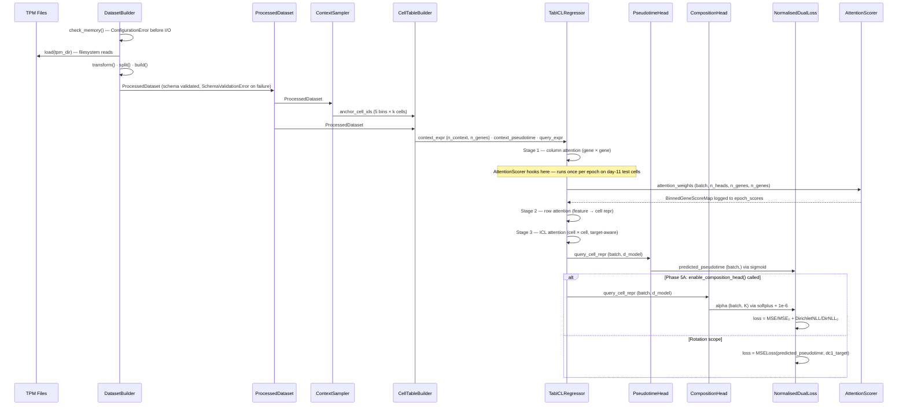
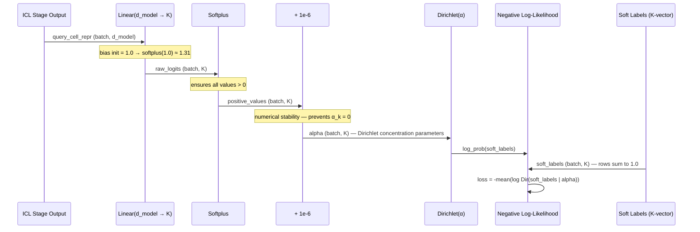
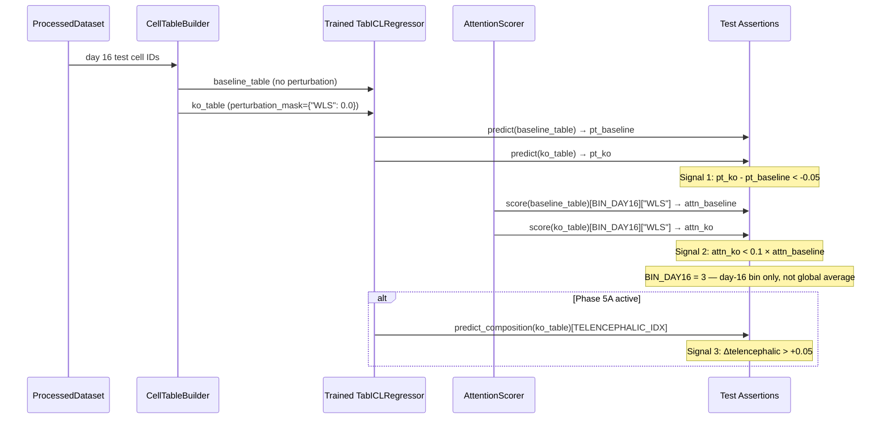

# Technical Design Document
## TabGRN-ICL: Tabular Foundation Model for Dynamic GRN Inference

**Version:** 1.1.0  
**Status:** Rotation Scope Active · Full Project Stubs Present  
**Project:** Joint rotation — Queen Mary University London / University College London  
**Supervisors:** Dr. Julien Gautrot · Dr. Yanlan Mao · Dr. Isabel Palacios  
**Author:** Christian Langridge  
**Last Updated:** March 2026

> **Changelog v1.0.0 → v1.1.0**
> Design review pass. Key changes: `AttentionScorer` now returns pseudotime-bin-stratified
> gene scores (`BinnedGeneScorer` protocol) rather than a global average, preserving
> cell-state-specific GRN signal. `GeneScorer` protocol split into `BinnedGeneScorer` +
> `GlobalGeneScorer`. `enable_composition_head()` enforces its own preconditions via
> `ModelState` enum + `PhasegateError`. `ProcessedDataset` constructor refactored to
> `DatasetBuilder` staged pattern. Memory pre-check formula corrected (`n_heads` not
> `d_model`), overhead budget added, and check re-ordered to run before I/O.
> `initialise_pipeline(rank)` introduced to compose setup calls. `validate_raw_inputs()`
> `Dirs.raw` reference bug fixed. EDA scripts wrapped in `main()`. Named exception
> hierarchy introduced. See Section 10 for full decision log.

---

## Table of Contents

1. [System Overview](#1-system-overview)
2. [Directory Structure](#2-directory-structure)
3. [Component Specifications](#3-component-specifications)
4. [Workflow & Data Flow](#4-workflow--data-flow)
5. [Implementation Details](#5-implementation-details)
6. [Integration Guide](#6-integration-guide)
7. [Configuration Reference](#7-configuration-reference)
8. [Test Architecture](#8-test-architecture)
9. [Deployment & Compute](#9-deployment--compute)
10. [Decision Log](#10-decision-log)

---

## 1. System Overview

### 1.1 Architectural Goals

TabGRN-ICL is a tabular in-context learning model for dynamic gene regulatory network (GRN) inference from single-cell RNA sequencing data. It is trained on the Jain et al. 2025 (Nature) brain organoid time-course dataset and targets two simultaneous prediction objectives:

| Objective | Output | Head | Status |
|---|---|---|---|
| Pseudotime regression | Scalar ∈ (0, 1) mapping to DC1 | `PseudotimeHead` | **Rotation scope — active** |
| Cell state composition | K-vector of Dirichlet parameters | `CompositionHead` | Full project — Phase 5A |

The model uses the **TabICLv2** pre-trained backbone, adapted for continuous regression targets via a dual-head output architecture. Column-wise attention (stage 1) is the primary source of GRN signal — it learns gene-gene regulatory dependencies as a byproduct of trajectory prediction, without requiring a prior adjacency matrix.

**GRN extraction specificity:** Column attention weights are extracted and scored *per pseudotime bin*, not averaged globally. Averaging over all cells would dilute stage-specific regulatory programs (e.g., the WLS-dependent non-telencephalic program active at day 16) with signal from developmental stages where those genes are uninvolved. See Section 3.10 and the `BinnedGeneScorer` protocol.

### 1.2 Core Design Principles

- **Explicit over implicit.** Every hyperparameter lives in `ExperimentConfig`. No magic numbers in implementation code.
- **Schema contracts at construction.** `ProcessedDataset` validates its own schema at build time via `DatasetBuilder`. Failures surface immediately as named exceptions, not mid-training as silent wrong results.
- **Phase gates with internal enforcement.** Full-project components exist as tested skeletons. Phase gates are enforced inside the gated method — not at the call site — using `ModelState` enum and `PhasegateError`. Call-site boilerplate cannot be silently omitted.
- **Tests as first-class artifacts.** RED phase tests are written before implementation. The WLS perturbation integration test is the only test with a wet-lab validated expected answer.
- **Hardware-tier portability.** Three named hardware tiers (`debug`, `standard`, `full`) ensure reproducibility across laptop, V100, and A100 without code changes.

### 1.3 Scientific Context

The model operates on the Matrigel-only condition of the Jain et al. 2025 time-course, which tracks brain organoid development across five collection days: 5, 7, 11, 16, 21. Pseudotime is sourced directly from the paper's Diffusion Component 1 (DC1), which is validated against chronological collection day in Figure 2b. Day 11 cells are withheld as a test set — they represent the neuroectoderm-to-neuroepithelial transition, the hardest interpolation point on the trajectory.

The WLS gene serves as the primary biological validation target. Jain et al. Figure 5h–k demonstrates that WLS knockout prevents non-telencephalic fate induction. The model's in-silico WLS knockout must reproduce this directional prediction. Signal 2 of the WLS perturbation test (attention drop) is evaluated specifically within the day-16 bin (`BIN_DAY16 = 3`), not against a global attention average.

---

## 2. Directory Structure

```
SMT-Pipeline/
├── pyproject.toml                      # Package registration — pip install -e .
├── smt_pipeline.yml                    # Conda environment
├── slurm_jobs.sh                       # Myriad HPC job scripts (all tiers)
├── LICENSE
├── README.md
│
├── experiments/                        # Auto-created at runtime
│   └── {run_id}/
│       ├── config.json                 # Serialised ExperimentConfig (every run)
│       ├── metrics.json                # MAE · attention_entropy · top20_bio_overlap
│       ├── shap_background.npy         # Locked SHAP background (created once, frozen)
│       └── checkpoints/
│           └── best_model.pt
│
├── data/
│   ├── EDA_tpm/
│   │   └── EDA_processed/
│   │       └── processed_tpm.csv       # Primary training data (Matrigel time-course)
│   └── model_data/
│       └── fleck_2022/                 # External validation — Fleck et al. 2022
│
├── path/
│   └── spatialmt/                      # Installable package root
│       │
│       ├── __init__.py
│       │
│       ├── exceptions.py               # Named exception hierarchy (all pipeline exceptions)
│       │
│       ├── config/
│       │   ├── __init__.py             # Re-exports: Dirs, Paths, PROJECT_ROOT,
│       │   │                           # initialise_pipeline
│       │   ├── paths.py                # Filesystem path resolution (env var + sentinel walk)
│       │   └── experiment.py           # ExperimentConfig + all sub-configs
│       │
│       ├── data/
│       │   ├── __init__.py
│       │   ├── dataset.py              # ProcessedDataset + DatasetBuilder
│       │   ├── manifest.py             # FeatureManifest — versioned gene set
│       │   └── loaders/
│       │       ├── __init__.py
│       │       ├── jain_loader.py      # Loads Jain et al. 2025 TPM files
│       │       └── fleck_loader.py     # Loads Fleck et al. 2022 (Phase 7)
│       │
│       ├── context/
│       │   ├── __init__.py
│       │   ├── sampler.py              # ContextSampler — 5-bin pseudotime stratification
│       │   └── builder.py              # CellTableBuilder — unified matrix construction
│       │
│       ├── model/
│       │   ├── __init__.py
│       │   ├── tabicl.py               # TabICLRegressor — main model wrapper
│       │   │                           # ModelState enum · PhasegateError
│       │   ├── heads/
│       │   │   ├── __init__.py
│       │   │   ├── pseudotime.py       # PseudotimeHead — sigmoid scalar output
│       │   │   └── composition.py      # CompositionHead — Dirichlet K-vector [Phase 5A]
│       │   └── baselines/
│       │       ├── __init__.py
│       │       ├── xgboost_baseline.py # XGBoost on HVG expression
│       │       ├── tabpfn_baseline.py  # TabPFN v2 performance ceiling [Phase 6]
│       │       ├── no_icl_baseline.py  # Single-cell, no context [Phase 6]
│       │       └── scratch_baseline.py # TabICLv2 architecture, no pretrain [Phase 6]
│       │
│       ├── training/
│       │   ├── __init__.py
│       │   ├── trainer.py              # Training loop — normalised loss, warmup, callbacks
│       │   ├── callbacks.py            # AttentionScorer callback, checkpoint saver
│       │   ├── scheduler.py            # Warmup + cosine LR scheduler
│       │   └── loss.py                 # MSELoss, DirichletNLL, NormalisedDualLoss
│       │
│       ├── explainability/
│       │   ├── __init__.py
│       │   ├── protocols.py            # BinnedGeneScorer + GlobalGeneScorer protocols
│       │   │                           # GeneScoreMap + BinnedGeneScoreMap type aliases
│       │   ├── scorers.py              # AttentionScorer (binned) + SHAPScorer (global)
│       │   ├── report.py               # ExplainabilityReport + per-bin disagreement taxonomy
│       │   └── perturbation.py         # PerturbationEngine — in-silico knockouts
│       │
│       └── evaluation/
│           ├── __init__.py
│           ├── metrics.py              # mae_day11, attention_entropy, top20_bio_overlap
│           ├── benchmark.py            # Five-model benchmark suite
│           └── external.py             # Fleck et al. 2022 zero-shot evaluation [Phase 7]
│
├── src/
│   ├── EDA_plotting/
│   │   ├── temporal_heatmap.py         # Wrapped in main() — safe to import
│   │   ├── PCA.py                      # Wrapped in main() — safe to import
│   │   └── temporal_lineplot.py        # Wrapped in main() — safe to import
│   └── experiments/
│       ├── run_tabicl_finetune.py      # Rotation primary — launches rotation_finetune preset
│       ├── run_xgboost_baseline.py     # Rotation baseline
│       ├── run_tabicl_scratch.py       # Ablation — no pretrain [Phase 6]
│       ├── run_tabicl_no_icl.py        # Ablation — no ICL [Phase 6]
│       └── run_full_dual_head.py       # Full dual-head run [Phase 5A]
│
└── tests/
    ├── conftest.py                     # Fixtures: debug_config, synthetic_dataset,
    │                                   # toy_model, synthetic_attention_weights,
    │                                   # correlated_expression,
    │                                   # synthetic_dataset_with_labels [Phase 5A]
    ├── unit/
    │   ├── test_paths.py               # _find_project_root() — env var, sentinel walk,
    │   │                               # error paths
    │   ├── test_dataset.py             # Schema contract tests — invalid-input tests for
    │   │                               # all load-bearing assertions (SchemaValidationError)
    │   ├── test_memory_check.py        # Parametrised tier tests (debug/standard/full/overflow)
    │   ├── test_experiment_config.py   # Serialisation, hash, preset tests
    │   ├── test_context_sampler.py     # Bin assignment, sparse bin warning
    │   ├── test_cell_table_builder.py  # Shape, perturbation mask, missing gene warning
    │   ├── test_attention_scorer.py    # Binned weights, top gene per bin, sum=1 per bin
    │   ├── test_shap_scorer.py         # Locked background, correlated-feature sign stability
    │   ├── test_composition_head.py    # hypothesis: alpha > 0 for all float32 inputs
    │   └── test_normalised_dual_loss.py # hypothesis: no inf/nan; InitialLossError on zero
    ├── smoke/
    │   └── test_toy_forward_pass.py    # Layer 2: toy model, shapes, no NaN, (0,1) range
    ├── integration/
    │   ├── test_hold_out_split.py      # Zero intersection, day 11 only in test set
    │   └── test_wls_perturbation.py    # Two-signal WLS test — Signal 2 uses BIN_DAY16=3
    │                                   # Skips with informative message if no checkpoint
    └── biological_sanity/
        └── test_sox2_attention.py      # Layer 3: SOX2 in top-20 per bin (manual,
                                        # post-training)
```

---

## 3. Component Specifications

### 3.1 `ExperimentConfig`
**File:** `path/spatialmt/config/experiment.py`

**Purpose:** Single source of truth for all hyperparameters. Serialised to `experiments/{run_id}/config.json` at training startup. Every run is fully reproducible from its config file alone.

**Sub-configs:**

| Sub-config | Key fields | Notes |
|---|---|---|
| `DataConfig` | `max_genes`, `test_timepoint=11`, `hardware_tier`, `n_cell_states=5`, `label_softening_temperature=1.0` | `log1p_transform` is validated as `True` at construction; raises if `False` |
| `ContextConfig` | `n_bins=5`, `cells_per_bin=5`, `max_context_cells=50`, `allow_replacement=True` | Validates `n_bins × cells_per_bin ≤ max_context_cells` |
| `ModelConfig` | `lr_col=1e-5`, `lr_row=1e-4`, `lr_icl=5e-5`, `lr_emb=1e-3`, `lr_head=1e-3`, `warmup_col_steps=500`, `warmup_icl_steps=100`, `output_head_init_bias=0.5`, `output_head_init_std=0.01` | `bio_plausibility_passed` populated post-training |
| `ExplainabilityConfig` | `shap_background_size=100`, `shap_background_seed=42`, `bio_plausibility_required=["SOX2"]` | SOX2 absence in top-20 (any bin) triggers fallback strategy |
| `PerturbationConfig` | `perturbation_mask={"WLS": 0.0}`, `pseudotime_delta_threshold=-0.05`, `attention_drop_fraction=0.1`, `composition_shift_threshold=0.05` | Signal 3 (composition) active only after `enable_composition_head()` |
| `BenchmarkConfig` | `baselines=["tabicl_finetune","xgboost"]` (rotation) | Full suite adds scratch, no_icl, tabpfn_v2 in Phase 6 |

**Named presets:**

```python
ExperimentConfig.debug_preset()           # 128 genes, CPU, 2 cells/bin
ExperimentConfig.rotation_finetune()      # 512 genes, V100, pseudotime only
ExperimentConfig.rotation_xgboost()       # XGBoost baseline, same HVG set
ExperimentConfig.full_finetune()          # 1024 genes, A100, dual-head [Phase 5A]
ExperimentConfig.scratch_preset()         # No pretrained weights [Phase 6]
ExperimentConfig.no_icl_preset()          # Single cell input [Phase 6]
```

**Dependencies:** `spatialmt.config.paths.Paths`, `dataclasses`, `json`, `hashlib`

---

### 3.2 `ProcessedDataset` + `DatasetBuilder`
**File:** `path/spatialmt/data/dataset.py`

**Purpose:** `ProcessedDataset` is an immutable, schema-validated container for one experiment's training data. Every downstream component receives this object; raw files are never accessed after construction. `DatasetBuilder` exposes the construction pipeline as individually-testable stages, with the memory feasibility check run first — before any data is loaded.

**`DatasetBuilder` staged construction:**

```python
dataset = (
    DatasetBuilder(config)
    .check_memory(gpu_memory_bytes)   # Raises ConfigurationError BEFORE any I/O
    .load(tpm_dir)                    # Filesystem reads only
    .transform()                      # log1p, HVG selection
    .split()                          # train/val/test — day 11 isolated as test
    .compute_soft_labels()            # Phase 5A only; no-op during rotation scope
    .build()                          # Runs _validate(), computes manifest hash, freezes
)

# Convenience wrapper — preserves existing call sites unchanged:
ProcessedDataset.from_tpm_files(tpm_dir, config, gpu_memory_bytes)
# Delegates to DatasetBuilder internally.
```

**`ProcessedDataset` fields:**

| Field | Shape | Type | Notes |
|---|---|---|---|
| `expression` | `(n_cells, n_genes)` | `np.float32` | log1p(TPM), validated max < 20.0 |
| `gene_names` | `(n_genes,)` | `list[str]` | HVG names in column order |
| `pseudotime` | `(n_cells,)` | `np.float32` | DC1 normalised to [0, 1] |
| `collection_day` | `(n_cells,)` | `np.int32` | ∈ {5, 7, 11, 16, 21} |
| `cell_ids` | `(n_cells,)` | `list[str]` | Unique identifiers |
| `train_cells` | `(n_cells,)` | `np.bool_` | Mutually exclusive with val/test |
| `val_cells` | `(n_cells,)` | `np.bool_` | 20% of non-test cells, stratified |
| `test_cells` | `(n_cells,)` | `np.bool_` | Day 11 only — enforced by `_validate()` |
| `soft_labels` | `(n_cells, K)` or `None` | `np.float32` | **Phase 5A** — `None` during rotation |
| `manifest_hash` | scalar | `str` | SHA-256 of gene_names + preprocessing_config |
| `preprocessing_config` | — | `dict` | Frozen record of all preprocessing decisions |

**Key methods:**

```python
ProcessedDataset.from_tpm_files(tpm_dir, config, gpu_memory_bytes)  # Convenience wrapper
ProcessedDataset._validate(instance)          # Raises SchemaValidationError — never bare assert
ProcessedDataset._build_splits()              # Day 11 test + stratified val
ProcessedDataset._compute_soft_labels()       # Distance-to-centroid softmax [Phase 5A]
ProcessedDataset._compute_manifest_hash()     # Deterministic, sorted key order
```

**Validation assertions (all checked at construction, all raise `SchemaValidationError`):**
- `train ∩ test = ∅`, `train ∩ val = ∅`, `val ∩ test = ∅`
- `set(collection_day[test_cells]) == {11}`
- `expression.max() < 20.0` — guards against raw TPM
- `pseudotime ∈ [0, 1]`
- No NaN or Inf in expression or pseudotime
- `soft_labels.sum(axis=1) ≈ 1.0` ± 1e-5 (when not None)

> **Why `SchemaValidationError` over bare `assert`:** Python's `-O` (optimise) flag, sometimes
> used in SLURM jobs, strips all `assert` statements silently. A bare `assert` that appears
> to guard a schema invariant provides no protection in optimised runs. Named exceptions are
> also directly testable with `pytest.raises(SchemaValidationError, match=...)`.

**Dependencies:** `numpy`, `pandas`, `spatialmt.config.experiment.DataConfig`, `spatialmt.exceptions`

---

### 3.3 `ContextSampler`
**File:** `path/spatialmt/context/sampler.py`

**Purpose:** Samples anchor cells for the ICL context window using pseudotime-stratified bin sampling. Guarantees every context window contains representation from all five developmental stages.

**Bin layout:**

| Bin | Collection day | Pseudotime range |
|---|---|---|
| 0 | Day 5 | [0.0, 0.2) |
| 1 | Day 7 | [0.2, 0.4) |
| 2 | Day 11 | withheld — excluded from sampling |
| 3 | Day 16 | [0.6, 0.8) |
| 4 | Day 21 | [0.8, 1.0] |

**`BIN_DAY16 = 3`** — used by `AttentionScorer` and `test_wls_perturbation.py` to index the day-16 specific GRN map.

**Sparse bin guard:** When a bin contains fewer cells than `cells_per_bin`, sampling proceeds with replacement and a `WARNING` is logged with the duplication count. This is auditable via `experiments/{run_id}/sampler_warnings.log`. Setting `allow_replacement=False` in `ContextConfig` raises instead.

**Inputs:** `ProcessedDataset`, `ContextConfig`, optional `bin_edges`  
**Output:** `(anchor_cell_ids: list[str], anchor_pseudotimes: np.ndarray)`

**Dependencies:** `numpy`, `spatialmt.data.dataset.ProcessedDataset`, `spatialmt.config.experiment.ContextConfig`

---

### 3.4 `CellTableBuilder`
**File:** `path/spatialmt/context/builder.py`

**Purpose:** Unified matrix construction for both context sampling and in-silico perturbation. Perturbation is architecturally identical to context construction with overrides applied — a single class handles both use cases, eliminating the most predictable DRY violation in the system.

**Primary method:**

```python
builder.build(
    cell_ids: list[str],
    perturbation_mask: dict[str, float] | None = None
) -> np.ndarray  # shape: (len(cell_ids), n_genes)
```

**Perturbation mask behaviour:**
- Each `{gene: value}` pair overrides the expression column for that gene
- Genes absent from `dataset.gene_names` (filtered by HVG selection) log a `WARNING` and are silently skipped
- The WLS knockout is `perturbation_mask={"WLS": 0.0}`

**Invariants enforced post-build:**
- Output shape == `(len(cell_ids), n_genes)`
- No NaN introduced by perturbation

**Dependencies:** `numpy`, `spatialmt.data.dataset.ProcessedDataset`, `spatialmt.config.experiment.ContextConfig`

---

### 3.5 `TabICLRegressor`
**File:** `path/spatialmt/model/tabicl.py`

**Purpose:** TabICLv2 backbone adapted for dual-head pseudotime regression and cell state composition. Manages differential learning rates, staged warmup, and the phase gate for enabling the composition head.

**Three-stage attention architecture:**

| Stage | Mechanism | LR | Warmup | Biological role |
|---|---|---|---|---|
| 1 — Column | Gene × gene attention | 1e-5 | 500 steps | GRN signal — `AttentionScorer` hooks here |
| 2 — Row | Feature → cell representation | 1e-4 | None | Aggregates gene context into cell vector |
| 3 — ICL | Cell × cell, target-aware | 5e-5 | 100 steps | Predicts query relative to anchor pseudotimes |

**Column embeddings:** Always re-initialised for `n_genes`. Pre-trained embeddings do not generalise to 512 gene tokens. Trained at `lr_emb=1e-3`.

**Model state machine:**

```python
class ModelState(Enum):
    PSEUDOTIME_ONLY = "pseudotime_only"   # Initial state — rotation scope
    DUAL_HEAD       = "dual_head"          # After enable_composition_head() — Phase 5A
```

**Phase gate — enforced internally:**

```python
def enable_composition_head(
    self,
    dataset: ProcessedDataset,
    config: ExperimentConfig,
) -> None:
    """
    Wires CompositionHead into forward(). Raises PhasegateError if any
    precondition is unmet — preconditions are not the caller's responsibility.
    """
    if not config.model.bio_plausibility_passed:
        raise PhasegateError(
            "Biological plausibility gate must pass before enabling composition head. "
            "SOX2 must appear in top-20 attention genes on day-11 test cells."
        )
    if not dataset.has_soft_labels:
        raise PhasegateError(
            "ProcessedDataset must be rebuilt with soft_labels before enabling "
            "composition head. Re-run DatasetBuilder with .compute_soft_labels()."
        )
    if self.state == ModelState.DUAL_HEAD:
        raise PhasegateError("Composition head is already enabled.")

    self._wire_composition_head()
    self.state = ModelState.DUAL_HEAD
```

**`configure_optimizers()` returns five parameter groups** (six after `enable_composition_head()`):
```python
[
    {"params": column_attention.parameters(),  "lr": 1e-5,  "name": "column_attention"},
    {"params": row_attention.parameters(),     "lr": 1e-4,  "name": "row_attention"},
    {"params": icl_attention.parameters(),     "lr": 5e-5,  "name": "icl_attention"},
    {"params": column_embeddings.parameters(), "lr": 1e-3,  "name": "column_embeddings"},
    {"params": pseudotime_head.parameters(),   "lr": 1e-3,  "name": "pseudotime_head"},
    # {"params": composition_head.parameters(), "lr": 1e-3, "name": "composition_head"},  # Phase 5A
]
```

**`on_training_step(step)` manages warmup:**
- At `step == warmup_col_steps`: unfreezes `column_attention_layers`, logs event
- At `step == warmup_icl_steps`: unfreezes `icl_attention_layers`, logs event

**Dependencies:** `torch`, `torch.nn`, `spatialmt.config.experiment.ModelConfig`, `spatialmt.exceptions`

---

### 3.6 `PseudotimeHead`
**File:** `path/spatialmt/model/heads/pseudotime.py`

**Purpose:** Regression head producing a scalar pseudotime prediction in `(0, 1)` from the query cell representation.

**Architecture:** `Linear(d_model, 1)` → `sigmoid` → `squeeze(-1)`

**Input:** `(batch, d_model)` query cell representation from ICL stage  
**Output:** `(batch,)` predicted pseudotime ∈ `(0, 1)`

**Initialisation:**
```python
nn.init.normal_(self.linear.weight, mean=0.0, std=0.01)   # near-zero weights
nn.init.constant_(self.linear.bias, 0.5)                   # trajectory midpoint prior
```

**Loss:** `MSELoss(predicted_pseudotime, dc1_target)`

**Key property:** Sigmoid guarantees output ∈ `(0, 1)` — predictions can never exceed the DC1 range. Boundary cells at day 5 (DC1 ≈ 0) and day 21 (DC1 ≈ 1) cannot generate destabilising gradients from overshooting.

---

### 3.7 `CompositionHead`
**File:** `path/spatialmt/model/heads/composition.py`

**Purpose:** Dirichlet head producing K concentration parameters representing cell state affinity across K=5 developmental states. Models uncertainty over the composition simplex rather than producing a point estimate.

**Architecture:** `Linear(d_model, K)` → `softplus` → `+ 1e-6`

**Input:** `(batch, d_model)` query cell representation (same vector as `PseudotimeHead`)  
**Output:** `(batch, K)` Dirichlet concentration parameters `α_k`, all strictly positive

**K=5 cell state index mapping:**

| Index | State | Dominant timepoint |
|---|---|---|
| 0 | Neuroectodermal progenitor | Day 5 |
| 1 | Neural tube neuroepithelial | Day 7 |
| 2 | Prosencephalic progenitor | Day 11 |
| 3 | Telencephalic progenitor | Day 16 |
| 4 | Early neuron | Day 21 |

**Initialisation:**
```python
nn.init.normal_(self.linear.weight, mean=0.0, std=0.01)
nn.init.constant_(self.linear.bias, 1.0)   # softplus(1.0) ≈ 1.31 ≈ Dir(1,...,1) uniform prior
```

**Loss:** Negative Dirichlet log-likelihood against soft labels  
**Target:** `soft_labels ∈ (0, 1)^K` with rows summing to 1.0 — computed by distance-to-centroid softmax from `ProcessedDataset`

**Phase gate:** Instantiated at model construction but not called in `forward()` until `model.enable_composition_head()` is invoked.

---

### 3.8 `NormalisedDualLoss`
**File:** `path/spatialmt/training/loss.py`

**Purpose:** Balances MSE and Dirichlet NLL so neither head dominates during training. Without balancing, Dirichlet NLL is approximately 38× larger than MSE at K=5 initialisation, driving almost all gradient signal.

**Mechanism:**
```python
# Step 0: compute initial loss values and freeze them
mse_0    = MSE(predictions_step0,    targets_pseudotime)    # ≈ 0.083
dir_nll_0 = DirichletNLL(alpha_step0, targets_soft_labels)  # ≈ 3.18 for K=5

# Every subsequent step:
loss = (mse_loss / mse_0) + (dir_nll_loss / dir_nll_0)
```

**Raises `InitialLossError`** if `mse_0` or `dir_nll_0` is zero at step 0 — division by zero would produce `inf` gradients silently. The error surfaces immediately with an actionable message rather than producing NaN weights several steps later.

**Properties:**
- Both terms equal 1.0 at step zero — equal gradient contribution from step one
- Scale-invariant to batch size and hardware tier
- `mse_0` and `dir_nll_0` are stored in `experiments/{run_id}/config.json` under `initial_loss_scales`

**Active only after:** `model.enable_composition_head()` — rotation scope uses plain `MSELoss`

---

### 3.9 `BinnedGeneScorer` and `GlobalGeneScorer` Protocols
**File:** `path/spatialmt/explainability/protocols.py`

**Purpose:** Two separate protocols reflecting the genuine architectural difference between scorers that produce per-developmental-stage gene rankings (`AttentionScorer`) and scorers that produce a single population-level ranking (`SHAPScorer`). A unified protocol would require one scorer to misrepresent its semantics.

**Type aliases:**
```python
GeneScoreMap       = dict[str, float]          # gene name → importance score
BinnedGeneScoreMap = dict[int, GeneScoreMap]   # bin index → GeneScoreMap
```

```python
class BinnedGeneScorer(Protocol):
    """
    For scorers that produce per-developmental-stage gene rankings.
    Implemented by: AttentionScorer
    """
    @property
    def name(self) -> str: ...

    def score(
        self,
        model: object,
        dataset: ProcessedDataset,
        query_cells: np.ndarray,
        perturbation_mask: dict[str, float] | None = None,
    ) -> BinnedGeneScoreMap: ...    # dict[int, dict[str, float]]

    def top_k(self, bin_idx: int, ..., k: int = 20) -> list[str]: ...


class GlobalGeneScorer(Protocol):
    """
    For scorers that produce a single population-level gene ranking.
    Implemented by: SHAPScorer
    """
    @property
    def name(self) -> str: ...

    def score(
        self,
        model: object,
        dataset: ProcessedDataset,
        query_cells: np.ndarray,
    ) -> GeneScoreMap: ...          # dict[str, float]

    def top_k(self, ..., k: int = 20) -> list[str]: ...
```

---

### 3.10 `AttentionScorer`
**File:** `path/spatialmt/explainability/scorers.py`  
**Implements:** `BinnedGeneScorer`

**Purpose:** Extracts column-attention weights from stage 1 of the TabICLv2 backbone. Returns a `BinnedGeneScoreMap` — one `GeneScoreMap` per pseudotime bin — where each gene's score within a bin is its mean outgoing attention weight across heads, computed only over cells belonging to that developmental stage.

**Why binned, not global:** Averaging attention weights over all cells destroys cell-state specificity. A WLS-dependent regulatory program active at day 16 is diluted to near-zero significance when averaged with day 5, day 7, and day 21 cells where WLS plays no role. Binned extraction recovers the stage-specific GRN signal.

**Execution context:** Runs **once per epoch on the day-11 test cells only** — not hooked into every training step. This is consistent with TabICL's paradigm: the model learns from context rather than repeated gradient exposure, so per-step accumulation provides no additional signal and creates unnecessary overhead.

**Stage specificity guard:**
```python
# AttentionScorerError raised if hook is registered on row or ICL attention layers
if layer_type != "column":
    raise AttentionScorerError(
        f"AttentionScorer must target column attention only. "
        f"Got layer_type='{layer_type}'. GRN interpretation requires stage 1."
    )
```

**Score computation (per bin):**
```python
# weights shape: (batch, n_heads, n_genes, n_genes)
# For each bin b ∈ {0, 1, 3, 4}  (bin 2 = day 11, withheld):
#   bin_weights = weights[cell_mask_b]         # cells in this bin only
#   reduced     = bin_weights.mean(dim=(0,1))  # (n_genes, n_genes) — mean over batch + heads
#   scores[b]   = reduced.mean(axis=0)         # (n_genes,) mean outgoing weight per gene
#   Assert scores[b].sum() ≈ 1.0               # softmax invariant, checked per bin
# Returns BinnedGeneScoreMap: dict[int, dict[str, float]]
```

**Per-epoch monitoring:** Logs Shannon entropy of scores per bin. High entropy in a given bin (model attends uniformly within that stage) signals that column attention has not learned a discriminative structure for that developmental stage — a per-bin trigger for the biological plausibility gate.

---

### 3.11 `SHAPScorer`
**File:** `path/spatialmt/explainability/scorers.py`  
**Implements:** `GlobalGeneScorer`

**Purpose:** KernelSHAP-based gene importance scoring. Model-agnostic — works on any baseline (XGBoost, TabPFN v2) without modification, enabling direct comparison of SHAP rankings across the benchmark suite.

**Execution context:** Offline — runs post-training on the frozen model checkpoint.

**Locked background:**
- Pseudotime-stratified sample of `shap_background_size=100` cells
- Drawn with `shap_background_seed=42`
- Saved to `experiments/{run_id}/shap_background.npy` on first call, loaded on all subsequent calls
- Never regenerated — ensures reproducibility across SHAP runs

**Stability guarantees (tested):**
- Top-5 SHAP genes are identical across two seeded runs with the same background
- Correlated features (Pearson r ≈ 1.0) produce SHAP values with identical sign

---

### 3.12 `ExplainabilityReport`
**File:** `path/spatialmt/explainability/report.py`

**Purpose:** Reconciles `AttentionScorer` (binned) and `SHAPScorer` (global) outputs into a structured disagreement taxonomy. Concordance is computed per developmental-stage bin, enabling stage-specific GRN relay node identification.

**Constructor:**
```python
ExplainabilityReport(
    attention_maps: BinnedGeneScoreMap,   # from AttentionScorer — one map per bin
    shap_map:       GeneScoreMap,         # from SHAPScorer — single global map
)
```

**Disagreement taxonomy (computed per bin):**

| Class | Condition | Biological interpretation |
|---|---|---|
| `CONCORDANT` | Both high or both low | Clean signal — report with confidence |
| `ATTENTION_ONLY` | High attention, low SHAP | Spurious correlation — gene is attended to but does not drive prediction |
| `SHAP_ONLY` | Low attention, high SHAP | **GRN relay node** — gene drives prediction via indirect regulatory path invisible to column attention |

**`SHAP_ONLY` genes are the primary scientific output.** A gene classified `SHAP_ONLY` in bin 3 (day 16) but `CONCORDANT` in bin 0 (day 5) is a **stage-specific GRN relay node** — a more precise claim than a global classification could support. These genes are candidates for cross-referencing against known GRN databases (TRRUST, RegNetwork, ChEA3).

**Output type:** `ExplainabilityResult` dataclass with properties:
- `concordant_genes[bin_idx]`, `attention_only_genes[bin_idx]`, `shap_only_genes[bin_idx]`
- `attention_entropy[bin_idx]`, `spearman_correlation`
- `bio_plausibility_passed`, `missing_required_genes`
- `paper_validated_in_top_attention`

---

## 4. Workflow & Data Flow

### 4.1 Training Data Flow



### 4.2 Composition Head Data Flow (Phase 5A)



### 4.3 WLS Perturbation Test Flow



---

## 5. Implementation Details

### 5.1 Softplus Activation

`CompositionHead` uses `torch.nn.Softplus` rather than `torch.nn.ReLU` or `torch.exp` to produce strictly positive Dirichlet concentration parameters.

```python
self.softplus = nn.Softplus()   # log(1 + exp(x))

def forward(self, x: torch.Tensor) -> torch.Tensor:
    return self.softplus(self.linear(x)) + 1e-6
```

**Why Softplus over alternatives:**

| Activation | Issue |
|---|---|
| `ReLU` | Produces exact zero for negative inputs — Dirichlet undefined at α=0 |
| `exp` | Numerically unstable for large positive inputs — overflow risk |
| `sigmoid` | Bounded to (0,1) — Dirichlet concentration parameters should not be capped at 1 |
| `Softplus` | Smooth, strictly positive, unbounded above, numerically stable |

### 5.2 Epsilon for Numerical Stability

```python
alpha = self.softplus(self.linear(x)) + 1e-6
```

The `1e-6` additive epsilon prevents two failure modes:

1. **Floating-point underflow.** Softplus is theoretically > 0 for all inputs but can underflow to 0.0 in float32 for large negative linear outputs early in training (before the bias initialisation takes effect).
2. **Dirichlet undefined at boundary.** `torch.distributions.Dirichlet.log_prob()` computes `(α-1) * log(x)` — if `α = 0`, this is `-inf` regardless of the input, producing NaN gradients on the first backward pass.

The epsilon is small enough that it has no meaningful effect on the distribution shape for `α > 0.01`.

> **Property-based test coverage:** `test_composition_head.py` uses `hypothesis` to verify
> `alpha > 0` for all float32 inputs in `[-100.0, 100.0]`. This is the RED phase test that
> confirms the epsilon is actually necessary — it will expose the exact input value at which
> softplus underflows to 0.0 in float32 without the epsilon.

### 5.3 Bias Initialisation Logic

**PseudotimeHead:**
```python
nn.init.constant_(self.linear.bias, 0.5)
# sigmoid(0.5) = 0.622 — slightly above midpoint
# In practice this means: at step 0, every cell is predicted slightly above DC1 midpoint
# The model learns trajectory by deviating from this prior
# This keeps initial MSE ≈ 0.083 (variance of Uniform[0,1])
# rather than ≈ 25-100 with random init (unstable initial gradients)
```

**CompositionHead:**
```python
nn.init.constant_(self.linear.bias, 1.0)
# softplus(1.0) ≈ 1.313
# All 5 concentration parameters initialised near 1.31
# This approximates Dir(1.31, 1.31, 1.31, 1.31, 1.31) — near-uniform
# The model learns state affinity by deviating from uniform assignment
# Initial Dirichlet NLL ≈ log Γ(K×1.31) - K×log Γ(1.31) ≈ 3.2 for K=5
```

**Weight initialisation (both heads):**
```python
nn.init.normal_(self.linear.weight, mean=0.0, std=0.01)
# Near-zero weights ensure predictions cluster near the bias at step 0
# Prevents large initial gradients from high-expression outlier cells
# Without this, a gene expressed at TPM 10000 (log1p ≈ 9.2) would
# push predictions far outside [0,1] before the sigmoid can compensate
```

### 5.4 Soft Label Generation (Phase 5A)

```python
def _compute_soft_labels(expression_pca, cluster_ids, config):
    # 1. Compute cluster centroids in PCA space (top 50 PCs)
    centroids = {k: expression_pca[cluster_ids == k].mean(axis=0) for k in range(K)}

    # 2. For each cell: distances to all centroids
    distances = np.array([
        [np.linalg.norm(cell - centroids[k]) for k in range(K)]
        for cell in expression_pca
    ])

    # 3. Temperature-scaled softmax of negative distances
    scaled = -distances / config.label_softening_temperature
    exp_scaled = np.exp(scaled - scaled.max(axis=1, keepdims=True))  # numerical stability
    soft_labels = exp_scaled / exp_scaled.sum(axis=1, keepdims=True)

    # Biological sanity check:
    # Day 5 cells should have highest mean affinity for state 0 (neuroectodermal)
    assert soft_labels[collection_day == 5, 0].mean() > 0.5

    return soft_labels.astype(np.float32)
```

**Temperature effects:**

| Temperature | Effect |
|---|---|
| `τ → 0` | Hard labels — each cell assigned entirely to nearest centroid |
| `τ = 0.5` | Sharp soft labels — cells near boundaries remain ambiguous |
| `τ = 1.0` | Default — moderate softness, appropriate for organoid data |
| `τ = 5.0` | Very soft — most cells near-uniform across states |

### 5.5 Memory Pre-Check

```python
# Approximate memory for model parameters + gradients + Adam optimiser states.
# Conservative estimate for TabICLv2 at any tier — update after Myriad profiling.
_NON_ATTENTION_OVERHEAD_BYTES: int = 2 * (1024 ** 3)   # 2 GB

@staticmethod
def _check_memory_feasibility(n_genes, n_heads, batch_size, gpu_memory_bytes):
    """
    Called as the FIRST stage of DatasetBuilder — before any data is loaded.
    Raises ConfigurationError if the column attention matrix cannot fit in GPU memory
    alongside model parameters, gradients, and optimiser states.
    """
    # Column attention matrix: batch × n_heads × n_genes × n_genes × float32
    attn_bytes = batch_size * n_heads * (n_genes ** 2) * 4

    # Reserve overhead for params + grads + Adam states; apply 80% safety margin to remainder
    budget = (gpu_memory_bytes - _NON_ATTENTION_OVERHEAD_BYTES) * 0.80

    if attn_bytes > budget:
        total_est = attn_bytes + _NON_ATTENTION_OVERHEAD_BYTES
        raise ConfigurationError(
            f"Estimated GPU memory required: ~{total_est / 1e9:.1f} GB "
            f"(available: {gpu_memory_bytes / 1e9:.1f} GB).\n"
            f"Reduce max_genes or use hardware_tier='full' on A100 (Myriad)."
        )
```

> **Formula correction (v1.0.0 → v1.1.0):** The original formula used `d_model` in place of
> `n_heads`. At standard tier (`d_model=512`, `n_heads=8`), this overestimated memory by 64×,
> causing every valid standard-tier configuration to fail the pre-check spuriously.

**Tier safe limits:**

| Tier | max_genes | n_heads | GPU | Safe batch size |
|---|---|---|---|---|
| `debug` | 128 | 8 | Any CPU | 2 |
| `standard` | 512 | 8 | V100 16GB | 16 |
| `full` | 1024 | 8 | A100 40GB | 32 |

---

## 6. Integration Guide

### 6.1 Rotation Scope Training Loop

```python
from spatialmt.config import initialise_pipeline
from spatialmt.config.experiment import ExperimentConfig
from spatialmt.data.dataset import ProcessedDataset
from spatialmt.context.sampler import ContextSampler
from spatialmt.context.builder import CellTableBuilder
from spatialmt.model.tabicl import TabICLRegressor
from spatialmt.explainability.scorers import AttentionScorer
from spatialmt.training.trainer import Trainer

# 1. Initialise filesystem and validate raw inputs (single call, rank-aware)
initialise_pipeline()   # single-GPU / notebook
# initialise_pipeline(rank=dist.get_rank())  # distributed — see Section 6.5

# 2. Load and save config (creates experiments/{run_id}/config.json)
cfg = ExperimentConfig.rotation_finetune(run_id="rotation_001")
cfg.save()

# 3. Build validated dataset (memory check runs first, before any I/O)
dataset = ProcessedDataset.from_tpm_files(
    tpm_dir=cfg.data.tpm_dir,
    config=cfg.data,
    gpu_memory_bytes=cfg.data.gpu_memory_bytes,
)

# 4. Instantiate model with pre-trained weights
model = TabICLRegressor.load_pretrained(
    config=cfg.model,
    n_genes=dataset.n_genes,
    checkpoint_path="weights/tabicl_v2_pretrained.pt",
)

# 5. Instantiate context components
sampler = ContextSampler(dataset, cfg.context)
builder = CellTableBuilder(dataset, cfg.context)

# 6. Instantiate AttentionScorer callback
attention_scorer = AttentionScorer(cfg.explainability)

# 7. Train (pseudotime head only — rotation scope)
trainer = Trainer(
    model=model,
    dataset=dataset,
    sampler=sampler,
    builder=builder,
    config=cfg,
    callbacks=[attention_scorer],
)
trainer.fit()

# 8. Metrics written automatically to experiments/rotation_001/metrics.json
```

### 6.2 Enabling the Composition Head (Phase 5A)

```python
# Preconditions are enforced inside enable_composition_head() — no call-site assertions needed.
# PhasegateError is raised with an actionable message if any precondition is unmet.

model.enable_composition_head(dataset=dataset, config=cfg)

# Switch to dual loss
from spatialmt.training.loss import NormalisedDualLoss
trainer.loss_fn = NormalisedDualLoss()   # Raises InitialLossError if initial loss is zero

# Retrain from the pseudotime checkpoint (warm start)
trainer.fit(resume_from="experiments/rotation_001/checkpoints/best_model.pt")
```

### 6.3 Running the WLS Perturbation Test

```python
import os
os.environ["TABGRN_CHECKPOINT"] = "experiments/rotation_001/checkpoints/best_model.pt"

# Run the integration test suite
# pytest tests/integration/test_wls_perturbation.py -v
#
# Signal 1: predict(ko) - predict(baseline) < -0.05
# Signal 2: attention(ko)[BIN_DAY16]["WLS"] < 0.1 × attention(baseline)[BIN_DAY16]["WLS"]
#           BIN_DAY16 = 3  — day-16 bin only, not global average
# Signal 3: composition shift toward telencephalic [Phase 5A only]
#
# If TABGRN_CHECKPOINT is unset or the file is absent, all WLS tests skip with an
# informative message referencing the missing checkpoint path. Vacuous green on missing
# checkpoint is guarded by a separate meta-test (test_wls_test_skips_with_informative_message).
```

### 6.4 Callback Registration

The `AttentionScorer` runs once per epoch on the day-11 test cells — it does not hook into every training step. This is consistent with TabICL's paradigm (learning from context, not repeated gradient exposure) and avoids raw attention tensor accumulation across the full training set.

```python
# Inside Trainer.fit():
for epoch in range(n_epochs):
    for batch in dataloader:
        ...
        loss.backward()
        optimizer.step()
        model.on_training_step(global_step)   # Handles warmup unfreezing

    # End of epoch — run attention scorer on day 11 test cells only
    for callback in self.callbacks:
        callback.on_epoch_end(model, dataset, epoch)
        # AttentionScorer returns BinnedGeneScoreMap, logs entropy per bin
```

### 6.5 Distributed / SLURM Setup

```python
import torch.distributed as dist
from spatialmt.config import initialise_pipeline

# Only rank 0 touches the filesystem
initialise_pipeline(rank=dist.get_rank())

# All ranks wait until rank 0 finishes
dist.barrier()

# Now all ranks can safely read data
dataset = ProcessedDataset.from_tpm_files(...)
```

`initialise_pipeline(rank)` encodes the rank-0 guard once, correctly. Writing the guard at every call site is a metadata-storm risk on Lustre/GPFS shared filesystems — concurrent `mkdir`/`exists` calls from 32+ ranks cause significant metadata overhead.

---

## 7. Configuration Reference

### 7.1 Hardware Tier Defaults

```python
HARDWARE_TIERS = {
    "debug":    {"max_genes": 128,  "batch_size": 2,  "max_context_cells": 10},
    "standard": {"max_genes": 512,  "batch_size": 16, "max_context_cells": 50},
    "full":     {"max_genes": 1024, "batch_size": 32, "max_context_cells": 100},
}
```

### 7.2 Biological Plausibility Gate

The plausibility gate must pass before the model is used for scientific interpretation.

**Required gene (hard gate):** `SOX2` must appear in top-20 column attention genes in at least one pseudotime bin on day 11 test cells.  
**Monitored genes:** `POU5F1`, `WLS`, `YAP1`, `SIX3`, `LHX2`

**Fallback decision tree:**
```
Bio plausibility FAILED
        │
        ├─► Check attention_entropy (per bin) at epoch 20
        │       │
        │       ├─► entropy > 8.5 (near-uniform over 512 genes) in most bins
        │       │       → Pre-training bias is harmful
        │       │       → Switch ModelConfig.finetune_strategy = "scratch"
        │       │       → Retrain from scratch
        │       │
        │       └─► entropy < 8.5 (model is focused, wrong genes)
        │               → LR schedule issue
        │               → Reduce lr_col to 5e-6, increase warmup_col_steps to 1000
        │               → Retrain from fine-tuned checkpoint
        │
        └─► If both attempts fail:
                → max_genes is likely too low
                → Switch to hardware_tier="full" on A100
                → Resubmit with max_genes=1024
```

---

## 8. Test Architecture

### 8.1 Test Layers and Scope

| Layer | Location | Requires | Runs in CI |
|---|---|---|---|
| Unit | `tests/unit/` | Synthetic fixtures only | Yes |
| Smoke | `tests/smoke/` | Toy model (untrained) | Yes |
| Integration | `tests/integration/` | Trained model checkpoint (skips with informative message without) | Partially |
| Biological sanity | `tests/biological_sanity/` | Trained model + real data | Manual only |

### 8.2 Key Test Fixtures

```python
# conftest.py — session-scoped, built once per test run

synthetic_dataset           # 100 cells, 10 genes, day 11 test, soft_labels=None
toy_model                   # TabICLRegressor(n_layers=2, d_model=32, n_genes=10)
synthetic_attention_weights # (n_heads=2, n_genes=10, n_bins=4) — SOX2 boosted in bin 3
correlated_expression       # GENE_02 and GENE_03 perfectly correlated (SHAP stability)

# Phase 5A fixture
synthetic_dataset_with_labels   # synthetic_dataset + Dirichlet soft_labels (K=5)
                                # @pytest.mark.full_project — skipped during rotation
```

### 8.3 Critical Tests

```python
# --- Path resolution (test_paths.py) ---

def test_env_var_takes_priority(monkeypatch, tmp_path):
    monkeypatch.setenv("PROJECT_ROOT", str(tmp_path))
    assert _find_project_root() == tmp_path

def test_env_var_nonexistent_raises(monkeypatch):
    monkeypatch.setenv("PROJECT_ROOT", "/nonexistent/xyz")
    with pytest.raises(RuntimeError, match="PROJECT_ROOT env var points to"):
        _find_project_root()

def test_sentinel_walk_finds_pyproject(tmp_path):
    (tmp_path / "pyproject.toml").touch()
    nested = tmp_path / "path" / "spatialmt" / "config"
    nested.mkdir(parents=True)
    with patch("spatialmt.config.paths.__file__", str(nested / "paths.py")):
        assert _find_project_root() == tmp_path

def test_sentinel_walk_no_pyproject_raises(tmp_path, monkeypatch):
    monkeypatch.delenv("PROJECT_ROOT", raising=False)
    nested = tmp_path / "deep" / "path"
    nested.mkdir(parents=True)
    with patch("spatialmt.config.paths.__file__", str(nested / "paths.py")):
        with pytest.raises(RuntimeError, match="Could not locate project root"):
            _find_project_root()


# --- ProcessedDataset schema contracts (test_dataset.py) ---
# All raise SchemaValidationError — never bare AssertionError

def test_test_cells_must_be_day_11_only(synthetic_dataset):
    bad = synthetic_dataset.copy()
    bad.collection_day[bad.test_cells] = 16
    with pytest.raises(SchemaValidationError, match="test_cells must contain only day 11"):
        ProcessedDataset._validate(bad)

def test_raw_tpm_rejected(synthetic_dataset):
    bad = synthetic_dataset.copy()
    bad.expression[0, 0] = 50000.0
    with pytest.raises(SchemaValidationError, match="expression.max"):
        ProcessedDataset._validate(bad)

def test_train_test_overlap_raises(synthetic_dataset):
    bad = synthetic_dataset.copy()
    bad.train_cells[np.where(bad.test_cells)[0][0]] = True
    with pytest.raises(SchemaValidationError, match="train.*test.*overlap"):
        ProcessedDataset._validate(bad)


# --- Memory pre-check (test_memory_check.py) ---

@pytest.mark.parametrize("tier,n_genes,n_heads,batch,gpu_gb,should_raise", [
    ("debug",    128,  8,  2, 16, False),
    ("standard", 512,  8, 16, 16, False),
    ("full",    1024,  8, 32, 40, False),
    ("overflow", 512,  8, 16,  1, True),
])
def test_memory_check_tier_behaviour(tier, n_genes, n_heads, batch, gpu_gb, should_raise):
    gpu_bytes = gpu_gb * (1024 ** 3)
    if should_raise:
        with pytest.raises(ConfigurationError):
            ProcessedDataset._check_memory_feasibility(n_genes, n_heads, batch, gpu_bytes)
    else:
        ProcessedDataset._check_memory_feasibility(n_genes, n_heads, batch, gpu_bytes)


# --- WLS perturbation (test_wls_perturbation.py) ---

BIN_DAY16 = 3   # day-16 bin index from ContextSampler

def test_wls_signal_1(trained_model, dataset, builder):
    pt_baseline = trained_model.predict(builder.build(day16_cells))
    pt_ko       = trained_model.predict(builder.build(day16_cells, {"WLS": 0.0}))
    assert (pt_ko - pt_baseline).mean() < -0.05

def test_wls_signal_2(trained_model, dataset, builder, attention_scorer):
    grn_baseline = attention_scorer.score(trained_model, dataset, day16_cells)
    grn_ko       = attention_scorer.score(trained_model, dataset, day16_cells, {"WLS": 0.0})
    assert grn_ko[BIN_DAY16]["WLS"] < 0.1 * grn_baseline[BIN_DAY16]["WLS"]

def test_wls_test_skips_with_informative_message():
    """Vacuous green on missing checkpoint is prevented by verifying the skip message."""
    result = subprocess.run(
        ["pytest", "tests/integration/test_wls_perturbation.py", "-v"],
        env={**os.environ, "TABGRN_CHECKPOINT": ""},
        capture_output=True, text=True,
    )
    assert "SKIPPED" in result.stdout
    assert "checkpoint" in result.stdout.lower()


# --- AttentionScorer softmax invariant (test_attention_scorer.py) ---

# Assert per bin, not globally
for bin_idx, gene_scores in binned_scores.items():
    assert abs(sum(gene_scores.values()) - 1.0) < 1e-5


# --- Numerical stability — hypothesis property tests ---

# test_composition_head.py
@given(st.floats(min_value=-100.0, max_value=100.0, allow_nan=False))
def test_alpha_always_positive(linear_output_value):
    x = torch.tensor([[linear_output_value] * 5], dtype=torch.float32)
    alpha = composition_head(x)
    assert (alpha > 0).all()

# test_normalised_dual_loss.py
@given(st.floats(min_value=1e-10, max_value=1.0, allow_nan=False, allow_infinity=False))
def test_no_inf_for_small_initial_loss(initial_mse):
    loss = NormalisedDualLoss()
    loss.mse_0 = torch.tensor(initial_mse)
    assert torch.isfinite(loss.compute_mse_term(torch.tensor(0.05)))

def test_zero_initial_loss_raises():
    loss = NormalisedDualLoss()
    with pytest.raises(InitialLossError, match="initial MSE loss is zero"):
        loss.set_initial_scales(mse_0=0.0, dir_nll_0=3.18)
```

---

## 9. Deployment & Compute

### 9.1 UCL Myriad Job Submission

```bash
# Step 1 — always run debug tier first (validates pipeline on CPU, no queue)
qsub slurm_jobs.sh   # see DEBUG_SCRIPT section

# Step 2 — rotation primary (submit by Week 7, May 6th)
qsub slurm_jobs.sh   # see ROTATION_FINETUNE_SCRIPT section
# Resources: V100 16GB, 24h, 32GB RAM

# Step 3 — XGBoost baseline (can run locally, no GPU needed)
python -m spatialmt.model.baselines.xgboost_baseline --preset rotation_xgboost

# Phase 5A — full dual-head (A100, submit July onwards)
qsub slurm_jobs.sh   # see FULL_FINETUNE_SCRIPT section
# Resources: A100 40GB, 48h, 64GB RAM
```

### 9.2 Environment Setup

```bash
# Clone and install
git clone https://github.com/ChristianLangridge/SMT-Pipeline.git
cd SMT-Pipeline
conda env create -f smt_pipeline.yml
conda activate smt_pipeline
pip install -e .                    # Registers spatialmt package

# Verify installation
python -c "from spatialmt.config import Paths; print(Paths.processed_tpm)"

# Run unit tests (no GPU, no real data required)
pytest tests/unit/ tests/smoke/ -v
```

### 9.3 Critical Milestones

| Date | Milestone |
|---|---|
| Week 2 end (Apr 1) | AnnData inspected — DC1, cluster labels, cell counts confirmed |
| Week 5 end (Apr 22) | `ProcessedDataset.from_tpm_files()` green, all unit tests passing |
| Week 7 end (May 6) | **First Myriad GPU job submitted — critical gate** |
| Week 10 (May 27) | Biological plausibility gate — SOX2 in top-20 (at least one bin) |
| Week 11 (Jun 3) | WLS perturbation Signals 1 + 2 passing |
| Week 15 (Jul 3) | Rotation report + talk submitted |
| Phase 5A start (Jul+) | Composition head enabled, dual-head training begins |

---

## 10. Decision Log

| Decision | Rationale | Alternatives considered |
|---|---|---|
| TabICLv2 as backbone | Native regression pre-training; clean two-stage attention; ICL with target-aware embeddings | TabICLv1 (classification-only pre-training), scGPT (gene-token, incompatible explainability) |
| DC1 as pseudotime target | Already computed in paper; validated against chronological collection day in Fig. 2b; no external tool needed | scVelo velocity pseudotime, Palantir branch probabilities |
| Day 11 withheld as test set | Hardest interpolation point — neuroectoderm-to-neuroepithelial transition | Random 80/20 split (correlated cells from same batch would leak), leave-one-out (too slow for rotation) |
| Dirichlet head over softmax | Models uncertainty over composition; flat Dirichlet = transitional cell; `Σα_k` is a meaningful confidence readout | Softmax (point estimate, no uncertainty), GMM posterior (requires separate clustering) |
| Distance-to-centroid softening | Preserves paper's biologically validated cluster identities; deterministic; temperature is explicit hyperparameter | Fuzzy c-means (clusters may not align with paper's annotations), GMM (arbitrary cluster order) |
| Normalised dual loss | Scale-invariant to batch size and hardware tier; both heads contribute equally from step 1 | Fixed λ annealing (requires tuning), manual λ (not portable across hardware) |
| XGBoost as primary baseline | Widely understood by biologists; no architectural assumptions; fastest to run; strong precedent for scRNA-seq | Linear regression (too weak), TabPFN v2 (useful ceiling but slower to set up) |
| Matrigel-only training (v1) | Linear trajectory; no branching topology; WLS perturbation has a clear directional ground truth | Both conditions combined (branching DC1 collapses into ambiguous [0,1] range) |
| `AttentionScorer` stage specificity guard | Silent extraction from wrong stage produces biologically uninterpretable weights with no error signal | Warning only (insufficient — wrong stage would invalidate all GRN claims) |
| 500-step column attention warmup | Column embeddings are re-initialised for gene count; pre-trained patterns must not be perturbed before embeddings stabilise | No warmup (column attention perturbed immediately by random embeddings), full freeze (column attention never fine-tunes) |
| **Binned attention extraction (`BinnedGeneScorer`)** | Averaging column attention weights over all cells destroys cell-state specificity. A WLS-dependent regulatory program active at day 16 is diluted to near-zero when averaged with day 5/7/21 cells where WLS is uninvolved. Per-bin extraction recovers the stage-specific GRN signal needed for biologically meaningful concordance classification and for Signal 2 of the WLS perturbation test. | Global average (implemented in v1.0.0 — retired; produces cell-type-agnostic GRN that cannot support stage-specific relay node claims) |
| **Split `GeneScorer` into `BinnedGeneScorer` + `GlobalGeneScorer`** | `AttentionScorer` and `SHAPScorer` have genuinely different return semantics. A unified protocol would require one scorer to misrepresent its output type — either `SHAPScorer` pads to a fake bin structure, or `AttentionScorer` loses its bin indexing. Two honest protocols eliminate the coercion and make each scorer independently and clearly testable. | Union return type `dict[int, GeneScoreMap] \| GeneScoreMap` with isinstance dispatch (isinstance dispatch is the implicit-over-explicit antipattern; rejected) |
| **`ModelState` enum + `PhasegateError` inside `enable_composition_head()`** | Preconditions checked only at the call site can be silently omitted in a new training script. A silent omission wires the composition head without `NormalisedDualLoss`, producing a training run that appears to succeed but generates meaningless composition outputs. Encoding preconditions inside the method makes them impossible to skip and directly testable as unit tests. | Call-site assertion boilerplate (v1.0.0 — retired; omittable and untestable in isolation) |
| **`DatasetBuilder` staged construction** | `from_tpm_files()` as a single monolithic constructor conflated I/O, transformation, splitting, and validation — each requiring different test infrastructure. The builder separates concerns, makes each stage independently testable without a filesystem, and corrects the critical ordering bug where the memory pre-check ran after data was already loaded. | Monolithic constructor with private helpers (private helpers are not directly testable; the memory ordering bug would persist) |
| **`_check_memory_feasibility` formula: `n_heads` not `d_model`** | The v1.0.0 formula `batch × n_genes² × d_model × 4` overestimated attention memory by 64× at standard tier (d_model=512 vs n_heads=8), causing every valid standard-tier configuration to fail the pre-check spuriously. Corrected to `batch × n_heads × n_genes² × 4`. `_NON_ATTENTION_OVERHEAD_BYTES` added to account for model parameters, gradients, and Adam optimiser states not captured by the attention matrix formula. | Original formula (retired — blocked all standard-tier training) |
| **`initialise_pipeline(rank=0)`** | Every entry point called `setup_output_dirs()` + `validate_raw_inputs()` as a pair. The distributed rank-0 guard pattern was duplicated at each call site. A missed guard on a multi-rank SLURM job causes concurrent filesystem metadata operations (mkdir, stat) from 32+ processes, producing metadata storms on Lustre/GPFS. Encoding the guard once in `initialise_pipeline()` makes it impossible to omit. | Paired calls at each entry point (v1.0.0 — retired; guard omittable, HPC metadata risk) |
| **`validate_raw_inputs()` references `Dirs.EDA_raw`** | v1.0.0 referenced `Dirs.raw`, which does not exist. The `FileNotFoundError` designed to help new users would instead raise `AttributeError` — crashing exactly when most needed, with no actionable output. | `Dirs.raw` (v1.0.0 — retired; AttributeError on the error path) |
| **EDA scripts wrapped in `main()`** | v1.0.0 executed data loading and plotting at module level. Any import (from tests, notebooks, or other scripts) triggered a filesystem read against `Paths.processed_tpm`. This silently crashed in test environments and blocked unit testing of any extracted logic. The `main()` wrap is the standard Python script pattern; path resolution is unaffected (it occurs at package import, not script execution). | Module-level execution (v1.0.0 — retired; import-time side effects block testing) |
| **Named exception hierarchy in `spatialmt.exceptions`** | Bare `AssertionError` (used in v1.0.0 for schema validation) is stripped by Python's `-O` flag, sometimes used in SLURM jobs. Named exceptions (`SchemaValidationError`, `ConfigurationError`, `PhasegateError`, `InitialLossError`) are testable with `pytest.raises(ExceptionType, match=...)`, produce informative messages, and are never silently stripped. | Bare `assert` statements (v1.0.0 — retired; stripped by `-O`, untestable with specific match strings) |

---

*This document reflects all architectural decisions through the v1.1.0 design review. Implementation code lives in the `tabgrn_v2_skeleton` directory. The rotation scope (pseudotime-only, XGBoost baseline, WLS Signals 1 + 2) targets July 3rd. Full dual-head project continues from that date.*